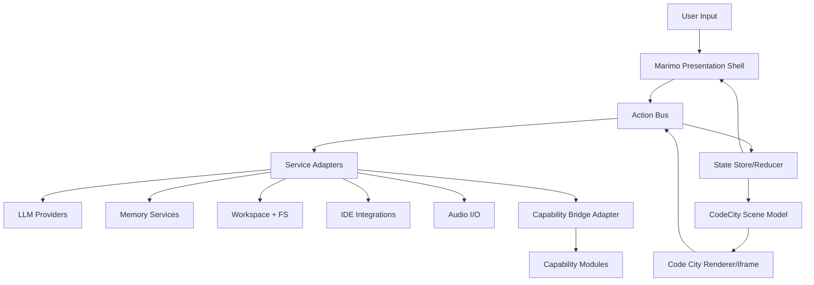
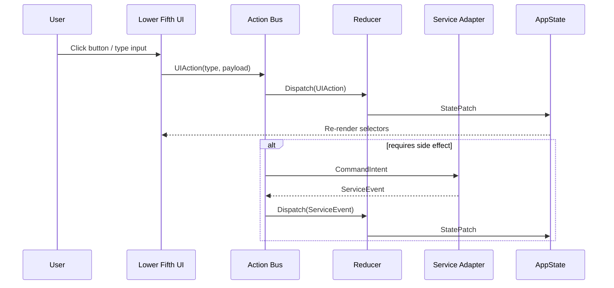
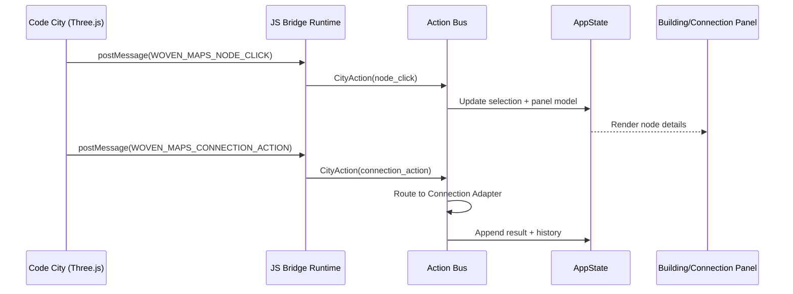
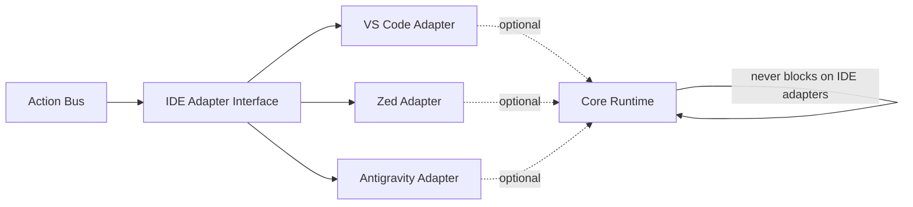
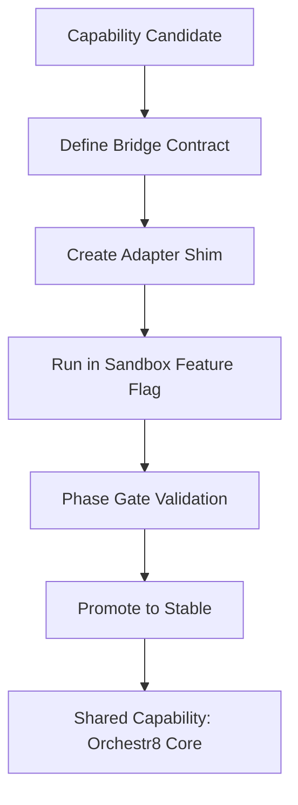
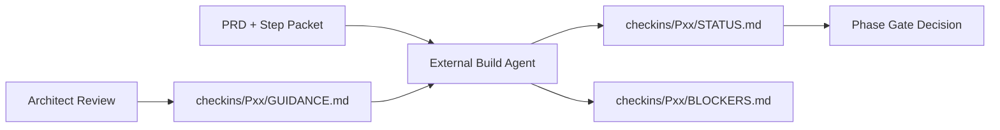

# Wiring Diagrams: orchestr8_next

## Diagram 1: System Boundary Map

## Diagram 2: Lower Fifth Control Flow

## Diagram 3: Code City Event Bridge

## Diagram 4: Optional IDE Integration Boundary

## Diagram 5: Capability Slice Migration Lane

## Diagram 6: Parallel Build + Check-in Workflow

## Wire Protocol Conventions

- All action envelopes use explicit `type`, `id`, `timestamp`, `payload` fields.
- Adapter responses include `source`, `ok`, `error`, `warnings`, and optional `result`.
- Bridge messages use versioned contracts: `contractVersion: "v1"`.

## Event Names (Reserved)

- `ui.apps.open`
- `ui.matrix.open`
- `ui.calendar.toggle`
- `ui.comms.toggle`
- `ui.files.toggle`
- `ui.flagship.cycle`
- `ui.search.invoke`
- `ui.record.toggle`
- `ui.playback.invoke`
- `ui.terminal.open`
- `ui.chat.send`
- `ui.attach.invoke`
- `city.node.click`
- `city.connection.action`
- `adapter.state.changed`
