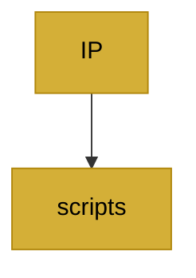

# Integration Roadmap: mermaid_generator.py → a_codex_plan

**Source:** `/home/bozertron/Orchestr8_jr/IP/mermaid_generator.py`  
**Target:** `a_codex_plan`  
**Date:** 2026-02-16  
**Pattern:** GAP

---

## 1. Public API Surface

### 1.1 Enums and Constants

| Symbol | Type | Description |
|--------|------|-------------|
| `FiefdomStatus` | `Enum` | Status levels: `WORKING` (Gold), `BROKEN` (Blue), `COMBAT` (Purple) |
| `COLORS` | `Dict[str, Dict[str, str]]` | Color mapping for status states with fill/stroke/text keys |

### 1.2 Data Classes

| Symbol | Type | Description |
|--------|------|-------------|
| `Fiefdom` | `@dataclass` | Represents a project fiefdom with path, status, connections, error_count, last_check |

### 1.3 Top-Level Functions

| Symbol | Signature | Description |
|--------|-----------|-------------|
| `generate_empire_mermaid` | `(fiefdoms: List[Fiefdom]) -> str` | Core generation - converts Fiefdom list to Mermaid markdown |
| `render_in_marimo` | `(fiefdoms: List[Fiefdom]) -> mo.mermaid` | Marimo integration - renders Mermaid in notebook |

---

## 2. Dependencies

### 2.1 Standard Library

```python
from pathlib import Path        # Path.name extraction for node labels
from typing import List, Dict, Optional  # Type hints
from dataclasses import dataclass  # Type contract decorator
from enum import Enum             # Status enumeration
```

### 2.2 External Dependencies

| Module | Purpose |
|--------|---------|
| `marimo` | For `mo.mermaid()` rendering in `render_in_marimo()` |

### 2.3 No Internal IP Dependencies

The module is self-contained and has no imports from other IP modules.

---

## 3. Integration Points

### 3.1 Current Usage

```
IP/mermaid_generator.py
    |
    +-- generate_empire_mermaid() --> Mermaid markdown string
    +-- render_in_marimo() --> mo.mermaid() rendered output
```

### 3.2 Expected Integration Pattern

The module is designed as a pure transformation layer:
- Input: `List[Fiefdom]` (structural data about project fiefdoms)
- Output: Mermaid markdown for visualization

**Entry Point:** `generate_empire_mermaid(fiefdoms: List[Fiefdom]) -> str`

---

## 4. GAP Analysis

### 4.1 Type Contracts

**Current State:** Uses `@dataclass` and `Enum` for type contracts.

| Contract | Current | Gap | Recommendation |
|----------|---------|-----|----------------|
| `FiefdomStatus` | `Enum` | No TypedDict variant | Add TypedDict for JSON serialization consistency with other modules |
| `Fiefdom` | `@dataclass` | No TypedDict variant | Add TypedDict variant (e.g., `FiefdomDict`) for feature-sliced JSON handling |
| `COLORS` | `Dict` | Hardcoded hex values | Consider moving to `IP/styles/orchestr8.css` or centralized theme |

**Recommended TypedDict Addition:**

```python
from typing import TypedDict, NotRequired

class FiefdomDict(TypedDict):
    path: str
    status: str  # FiefdomStatus.value
    connections: list[str]
    error_count: NotRequired[int]
    last_check: NotRequired[str]
```

### 4.2 State Boundary

**Current State:** Stateless - no internal state management.

| Aspect | Status | Notes |
|--------|--------|-------|
| `_component_state` | N/A | Module is pure/referential - takes input, produces output |
| State persistence | N/A | No file-based state; caller manages Fiefdom data |
| Caching | N/A | No caching layer - regeneration on each call |

**Gap:** The module has no state boundary because it is designed as a pure function. If caching is needed for performance, a wrapper layer would be required.

### 4.3 Bridge (Mermaid Output)

**Current Output Format:**



| Aspect | Status | Notes |
|--------|--------|-------|
| Output type | `str` | Mermaid markdown string |
| Rendering | `mo.mermaid()` | Marimo native integration |
| Edge direction | `TD` (top-down) | Could be parameterized (LR/TB) |
| Node shape | `["label"]` | Rectangle with label |

**Gap Opportunities:**
- Parameterize graph direction (`TD` vs `LR` vs `BT`)
- Add subgraphs for clustering fiefdoms
- Support different node shapes for status indication
- Add tooltips or descriptions via node metadata

### 4.4 Integration Logic

**Entry Points:**

| Function | Purpose | Called By |
|----------|---------|-----------|
| `generate_empire_mermaid()` | Core generation logic | `render_in_marimo()`, direct callers |
| `render_in_marimo()` | Marimo rendering | UI layer (06_maestro.py) |

**Current Integration Path:**
```
06_maestro.py --> render_in_marimo() --> generate_empire_mermaid() --> mo.mermaid()
```

**Gap Analysis:**

| Integration Aspect | Current | Gap |
|-------------------|---------|-----|
| Error handling | Minimal | No try/catch around Mermaid generation |
| Fallback rendering | None | If Mermaid fails, no graceful degradation |
| Node ID collision | Sequential N0, N1... | Could conflict with complex graphs |
| Empty input | Returns `graph TD` | Should return informative message |

---

## 5. Recommendations

### 5.1 High Priority

1. **Add error handling wrapper:**
   ```python
   def generate_empire_mermaid_safe(fiefdoms: List[Fiefdom]) -> str:
       try:
           return generate_empire_mermaid(fiefdoms)
       except Exception as e:
           return f"graph TD\n    E[Error: {str(e)}]"
   ```

2. **Support empty state:**
   ```python
   if not fiefdoms:
       return "graph TD\n    E[No fiefdoms detected]"
   ```

### 5.2 Medium Priority

3. **Add TypedDict variants for JSON compatibility:**
   - `FiefdomDict` for serialization
   - `FiefdomStatusDict` for status values

4. **Parameterize graph direction:**
   ```python
   def generate_empire_mermaid(fiefdoms: List[Fiefdom], direction: str = "TD") -> str:
       lines = [f"graph {direction}"]
   ```

5. **Add subgraph clustering:**
   ```python
   def generate_empire_mermaid(fiefdoms: List[Fiefdom], cluster_by: str = None) -> str:
       # Cluster fiefdoms by parent directory
   ```

### 5.3 Low Priority

6. **Move colors to centralized theme:**
   - Extract `COLORS` to `IP/styles/theme.py` or similar
   - Align with existing color constants in other modules

7. **Add tooltips/descriptions:**
   - Extend node format: `N0["label"|"tooltip"]`

---

## 6. Summary

| Category | Status | Risk |
|----------|--------|------|
| Type Contracts | Low (dataclass/Enum) | Low - functional |
| State Boundary | N/A (stateless) | Low - pure functions |
| Bridge | Functional | Low - outputs valid Mermaid |
| Integration Logic | Basic | Medium - needs error handling |

**Overall Integration Readiness:** READY WITH CAVEATS

The module is functional and integrates cleanly. Primary gaps are around error handling and empty state handling rather than structural issues.
