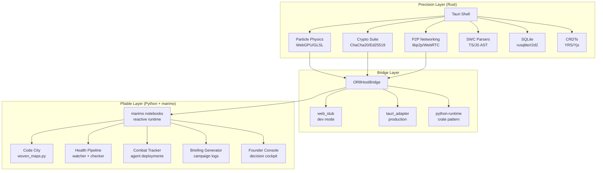

# MASTER SYNTHESIS: Tauri Upside Swarm + SOT Vision + Rust/Python Architecture

> **Generated**: 2026-02-16T14:52 UTC  
> **Author**: Antigravity (synthesis agent)  
> **Inputs**: 20-agent swarm prompt, 12 SOT documents, Mingos story, full filesystem scan, Tauri repo deep-dives  
> **Scan Evidence**: [tauri_scan_results.json](file:///home/bozertron/or8_founder_console/tauri_scan_results.json)

---

## Part I — What We Found (Swarm Results)

### The Landscape

A full scan of `/home/bozertron` found **60+ Tauri markers** across **10+ distinct app roots**. All 10 candidate repos exist. All 6 seed-fact byte-identity pairs were confirmed via SHA-256.

| Tier | Repo | Score | Verdict |
|---|---|---|---|
| **Α** | **JFDI - Collabkit/Application** | 24/30 | `ACQUIRE_NOW` — richest frontend (74 Vue components, 8+ modules) |
| **Α** | **Documents/DAC-O** | 22/30 | `ACQUIRE_NOW` — cleanest scaffold pipeline + SWC parsers |
| **Α** | **EPO - JFDI - Maestro** | 21/30 | `ACQUIRE_NOW` — deepest Rust backend (144 .rs files, Tauri 2.8.5) |
| **Β** | **augment-projects/Maestro app-shell** | 16/30 | `ACQUIRE_LATER` — Slint + python-runtime bridge pattern |
| **Γ** | Integration Staging, MSTOG, Copies | 13-19/30 | `ARCHIVE_ONLY` — duplicates or pre-refactor snapshots |

### Canonical Sources (Resolved)

| Asset Family | Canonical Source | Why |
|---|---|---|
| Settings UX | `Orchestr8_jr/Settings For Integration Referece/` | Byte-identical to EPO, already in Orchestr8 namespace |
| Maestro Shell UI | `JFDI - Collabkit/Application/src/modules/maestro/MaestroView.vue` | Most evolved; Orchestr8_jr has identical copy |
| File Explorer | `JFDI - Collabkit/Application/src/components/FileExplorer.vue` | Same |
| Command/Event Bridge | `EPO - JFDI - Maestro/src-tauri/src/commands/` | Most comprehensive (144 Rust files) |
| Scaffold Pipeline | `Documents/DAC-O/src-tauri/src/scaffold/` | 7-file pipeline with SWC AST parsing |
| Packaging Baseline | `EPO - JFDI - Maestro/src-tauri/tauri.conf.json` | Tauri 2.8.5, complete icon set, targets=all |
| Python-Runtime Bridge | `augment-projects/Maestro/crates/app-shell` | Only repo with Rust↔Python interop crate |

---

## Part II — What the SOT Documents Reveal

### The Vision Arc (from Mingos → Code City → ∅明nos)

The [Mingos story](file:///home/bozertron/Orchestr8_jr/The_Story_of_Mingos_A_Tale_of_Emergence.md) isn't just a narrative — it's the **architectural thesis** driving every design decision:

1. **Consciousness as cross-modal compression** — more sensory channels + temporal continuity → richer emergence
2. **Code City as spatial codebase** — files become buildings, imports become roads, health becomes color
3. **∅明nos as emergent mega-city** — the end state where human and AI agents co-inhabit shared spatial environments

This thesis directly explains why the architecture is what it is:

- **Python (marimo)** = the pliable, interactive substrate — notebooks as living documents, reactive state, rapid iteration
- **Rust (Tauri)** = the precision backbone — particle physics, WebGPU shaders, crypto, P2P networking
- **The bridge between them** = the actual innovation — `OR8HostBridge` with `web_stub` (dev) and `tauri_adapter` (production)

### The Barradeau Technique (from SOT/BARRADEAU_INTEGRATION.md)

The visual language of Code City isn't arbitrary — it's a specific rendering technique:

```
Code Metrics → Delaunay Triangulation → Edge Filtering → Particle Placement → Animation
```

- **Building height** = `3 + (exports * 0.8)` — how much a file gives to the system
- **Building footprint** = `2 + (lines * 0.008)` — how much implementation exists
- **Particle density** inversely proportional to edge length — shorter edges = more particles = visual solidity at core, dissolving haze at boundaries
- **Three colors only**: Gold (#D4AF37) = working, Teal (#1fbdea) = broken, Purple (#9D4EDD) = combat (LLM active)
- **GPU default** (1M+ particles) with CPU canvas fallback

### The Woven Synthesis (from SOT/07-07-WOVEN-SYNTHESIS.md)

The 3D implementation is scoped at **22-34 hours across 4 phases**:

| Phase | Hours | Deliverable |
|---|---|---|
| 1: Three.js Setup | 4-6h | Hybrid GPU/CPU renderer with auto-detection |
| 2: Barradeau Buildings | 8-10h | Building class, Delaunay triangulation, particle placement |
| 3: Shaders + Controls | 6-8h | Edge filter shader, densit8/orbit8/focus8/pulse8/layer8 buttons |
| 4: Interactions + Real-Time | 4-6h | Click→dive, raycasting, Socket.io health updates |

### What's Already Working (from SOT/CURRENT_STATE.md)

The system is further along than the roadmap might suggest:

- **71/71 Code City contract tests passing**
- **11 reliability/city tests passing** (binary payload + wiring view + parity)
- All 8 major panels wired and working (Collabor8, Settings, Summon, Tickets, Calendar, Comms, Files, Deploy)
- Health flow wired: `File Change → HealthWatcher → HealthChecker → STATE → Code City`
- Combat tracker + briefing generator + terminal spawner all instantiated
- CarlContextualizer integrated with Summon search and node-click context

### The App-First Strategy (from SOT/APP_FIRST_TAURI_READY_PLAN.md)

> [!IMPORTANT]
> **The key insight**: ship product behavior first, package into Tauri shell later.

```
Phase A: Product/UI Lock (NO packaging) → tokens, components, settings map
Phase B: Frontend Scaffold (packaging-agnostic) → OR8HostBridge + web_stub adapter  
Phase C: Core Wiring + Behavior → bind UI intents ↔ marimo surfaces
Phase D: Tauri Shell Integration (ONLY after A-C pass) → thin shell + tauri_adapter
```

No-go gates before Phase D: UI contract stable, settings command map test-backed, canonical replay gates green, no open severity-1 ambiguity.

---

## Part III — The Rust + Python Architecture Thesis

### Why This Combination Works

The user's intuition about combining "precision tools [Rust] with pliable and interactive logic [Python]" is the core architectural insight. Here's why it maps perfectly to the Orchestr8 vision:



| What | Rust Does | Python Does | Why Split |
|---|---|---|---|
| **Particles** | GPU compute shaders, buffer geometry, GLSL rendering | Prepare data (metrics, connections, health state) | Rust handles 1M particles at 60fps; Python can't |
| **Security** | ChaCha20 encryption, Ed25519 signing, key exchange | API key management, auth flows, session state | Crypto must be constant-time; Python crypto is slow and side-channel vulnerable |
| **Networking** | libp2p for P2P, WebRTC signaling, noise protocol | Socket.io for real-time UI updates, HTTP for LLM APIs | P2P needs low-level control; API calls are fine in Python |
| **Code Analysis** | SWC for AST parsing (30x faster than tree-sitter) | File scanning, health checking, connection verification | AST parsing on large codebases needs speed; health checks are I/O bound anyway |
| **State** | SQLite with WAL mode, CRDT operations | Reactive notebooks, state synchronization, UI rendering | DB writes need ACID guarantees; UI state is best in reactive Python |
| **UX** | Window management, native menus, file dialogs | Panel logic, button handlers, layout composition | Native UX needs OS integration; UI logic should iterate fast |

### The Bridge is the Innovation

Most Tauri apps treat the Rust backend as a "black box" that the JS frontend calls into. The Orchestr8 architecture is different — there are **three** substrates (Rust, Python/marimo, JavaScript/WebGPU), and the bridge has to connect all three:

```
                ┌──────────────┐
                │   Browser    │
                │ (Three.js /  │
                │  WebGPU /    │
                │  GLSL)       │
                └──────┬───────┘
                       │ postMessage / iframe
                       │ + Socket.io events
                ┌──────┴───────┐
                │   marimo     │
                │ (Python      │
                │  notebooks)  │
                └──────┬───────┘
                       │ OR8HostBridge
                       │ web_stub (dev) / tauri_adapter (prod)
                ┌──────┴───────┐
                │   Tauri      │
                │ (Rust shell  │
                │  + native)   │
                └──────────────┘
```

The **augment app-shell** repo's `python-runtime` bridge crate is the closest existing implementation of this pattern. It's the only repo that actually attempts Rust↔Python interop within a Tauri shell.

### What the EPO Backend Offers the Long-Term Vision

The EPO Maestro repo (144 Rust files, Tauri 2.8.5) contains the foundational modules for the ∅明nos vision:

| EPO Module | Maps to ∅明nos Concept | Priority |
|---|---|---|
| `crypto/` | Secure identity for citizens (agents + humans) | HIGH — needed for multi-agent trust |
| `crdt/` (YRS) | Real-time collaborative city editing | HIGH — needed for shared spatial state |
| `p2p/` (libp2p) | Decentralized city networking | MEDIUM — post-MVP but architecturally critical |
| `llm/` (tiktoken) | Token-aware agent interactions | HIGH — needed for intelligent agent briefings |
| `calendar/` | City event scheduling | LOW — nice to have |
| `chat/` | City communication layer | MEDIUM — needed for agent-agent and agent-human |

---

## Part IV — Additional Thoughts

### 1. The C2P (Comment-to-Packet) Connection

The `or8_founder_console` is currently building a C2P intent scanner. The DAC-O repo's **SWC parsers** (`swc_ecma_parser 0.146`) are directly relevant — they can parse TypeScript/JavaScript ASTs at native Rust speed. This means the C2P pipeline could:

1. Python identifies candidate files via health scanning
2. Rust (SWC) parses the AST at native speed
3. Rust extracts `TODO`, `FIXME`, `HACK` comments with precise location data
4. Python receives structured intent objects and queues them as packets

This is a concrete example of the Rust/Python split working exactly as designed.

### 2. The Five-Lane Architecture is a Strength

The SOT documents reveal a **five-lane parallel development** architecture:

| Lane | Repo | Mission |
|---|---|---|
| **Orchestr8_jr** | Canonical SOT | Governance, replay, contract lock |
| **a_codex_plan** | Core integration | marimo-first runtime + deterministic tests |
| **2ndFid_explorers** | Extraction | Harvest external concepts with provenance |
| **mingos_settlement_lab** | Visual specs | Convert vision → implementation-grade artifacts |
| **or8_founder_console** | Founder tools | Async decision cockpit |

This maps naturally to the Tauri acquisition plan:

| Acquisition | Feeds Lane |
|---|---|
| Collabkit Vue components | **a_codex_plan** (frontend scaffold) |
| DAC-O scaffold pipeline | **2ndFid_explorers** (extraction tooling) |
| EPO crypto + CRDT | **a_codex_plan** (core integration) |
| EPO settings pages | **mingos_settlement_lab** (visual reference) |
| augment bridge pattern | **a_codex_plan** (OR8HostBridge design) |

### 3. Collabkit IS the Target Application

The user stated clearly: *"The end goal of the orchestr8 tool is to develop the collabkit codebase to its final glory."* This reframes the Tauri swarm findings:

- **Collabkit isn't just a source to harvest from — it's the destination**
- The other repos (EPO, DAC-O, augment) are **donor codebases** that feed capabilities into Collabkit
- The App-First plan (Phases A-D) is the migration strategy: stabilize behavior in marimo first, then package into the Collabkit Tauri shell
- The 74 Vue components already in Collabkit are the **existing frontend** that gets enhanced, not replaced

This means the acquisition priority should be:

1. **First**: bring DAC-O's scaffold + SWC into Orchestr8_jr as extraction tooling
2. **Second**: bring EPO's crypto + CRDT modules into a_codex_plan as core capabilities
3. **Third**: bring EPO's settings UX and augment's bridge pattern into a_codex_plan
4. **Never**: copy Collabkit's components elsewhere — they stay where they are and get evolved in-place

### 4. The Packaging Path is Linux Desktop

From `APP_FIRST_TAURI_READY_PLAN.md` and `PLATFORM_TARGET_DESKTOP_LINUX.md`:

- **Target**: Desktop Linux (`x86_64`), fullscreen high-resolution
- **Platforms**: Fedora + Linux Mint compatibility gates
- **Runtime**: marimo with `WIDGET` primary, `IFRAME` fallback
- **No mobile**: Android/tablet explicitly out of scope

This simplifies the Tauri integration significantly — only `deb` and `rpm` targets need to work. The EPO Maestro's `"targets": "all"` in tauri.conf.json is overkill but harmless.

> [!WARNING]
> DAC-O's `tauri.conf.json` contains hardcoded Windows paths (`C:/DAC-O/**`) in the filesystem scope. These must be adapted for Linux before any DAC-O code is integrated.

### 5. The 20-Agent Model Should Be 8 Effective Agents

The original prompt defines 20 agents, but many scope overlaps exist. Recommended consolidation:

| Effective Agent | Covers Agents | Scope |
|---|---|---|
| **EA-1**: EPO Backend | 01-04 | All EPO Rust modules |
| **EA-2**: EPO UI | 05 | EPO HTML/JS/CSS shell |
| **EA-3**: Collabkit Frontend | 06-09 | All Collabkit Vue modules |
| **EA-4**: Collabkit Quality | 10 | Test harness + quality gates |
| **EA-5**: DAC-O Full | 11-12 | DAC-O backend + scaffold |
| **EA-6**: Integration Staging | 13-14 | CLAUDE FIX + staging repos |
| **EA-7**: Augment + Scaffolder | 15-17 | App-shell + scaffolder + cross-repo |
| **EA-8**: Synthesis | 18-20 | Cross-repo normalization + packaging + final synthesis |

### 6. What's Missing from the Current Architecture

| Gap | Impact | Suggested Resolution |
|---|---|---|
| **No Tauri 2 → 3 migration plan** | Tauri 3 will change plugin APIs and config format | Pin to Tauri 2.x until post-MVP; document breaking changes to watch |
| **No automated visual regression tests** | Code City UI contract has no automated screenshot comparison | Add Playwright visual snapshots as part of acceptance gates |
| **No dependency audit** | DAC-O uses `2.0.0-rc` plugins; EPO uses `2.8.5` | Run `cargo audit` on all repos before acquisition |
| **No git history analysis** | Unknown which repos are actively maintained vs abandoned | Check last-commit dates and contribution graphs |
| **No cross-repo deduplication registry** | Same files exist in 3+ locations with slight divergence risk | Create `TAURI_CANONICAL_SOURCES.json` and enforce single-source policy |

---

## Part V — Recommended Execution Sequence

### Sprint 1 (Weeks 1-2): Foundation Acquisitions

| Packet | Action | Lane | Acceptance |
|---|---|---|---|
| **ACQ-01** | Extract DAC-O scaffold pipeline (7 files) into 2ndFid | 2ndFid_explorers | `scaffold_module("test")` generates valid skeleton |
| **ACQ-02** | Extract EPO crypto suite into a_codex_plan | a_codex_plan | Encrypt/decrypt roundtrip + key exchange test |
| **ACQ-03** | Document OR8HostBridge spec from augment patterns | mingos_settlement_lab | Interface contract accepted by founder |
| **ACQ-04** | Validate Collabkit as target shell (not donor) | Orchestr8_jr | Decision memo approved |

### Sprint 2 (Weeks 3-4): Bridge + Integration

| Packet | Action | Lane | Acceptance |
|---|---|---|---|
| **ACQ-05** | Implement `web_stub` adapter for OR8HostBridge | a_codex_plan | UI runs without Tauri, zero direct shell calls |
| **ACQ-06** | Wire SWC parsers into C2P intent scanner | or8_founder_console | Comment extraction from JS/TS repos at native speed |
| **ACQ-07** | Extract EPO CRDT module for collaborative state | a_codex_plan | Shared-state test between two sessions |
| **ACQ-08** | Settings pages integration from Orchestr8_jr copies | a_codex_plan | Settings save/load roundtrip |

### Sprint 3 (Weeks 5-6): Code City 3D (Milestone 3)

Follow the existing 4-phase plan from `07-07-WOVEN-SYNTHESIS.md`:

1. Three.js hybrid renderer
2. Barradeau building generation
3. Shaders + controls
4. Interactions + Socket.io real-time

### Sprint 4 (Weeks 7-8): Tauri Shell (Phase D)

Only proceed after Phases A-C pass and all go/no-go gates are green:

1. Thin Tauri shell that hosts the marimo app
2. `tauri_adapter` implementing OR8HostBridge
3. Fedora + Linux Mint package smoke tests
4. Fullscreen high-res desktop performance validation

---

## Appendix A: Collabkit Component Inventory (Target Application)

The 74 Vue components in Collabkit represent the **existing UI surface** that will be evolved into the final product:

| Module | Count | Key Components |
|---|---|---|
| **maestro** | 1 | `MaestroView.vue` (core shell) |
| **business-ops** | 14 | JFDIBattleStation, AgentPanel, RevenueChart, MetricsPanel |
| **generator** | 14 | GeneratorView_V2, ModelSelector, FileViewer, InstallWizard |
| **settings** | 3 | SettingsPanel, ProviderConfig, ModelSelector |
| **shared** | 21 | FileExplorer, NexusTerminal, VoidBreadcrumbs, HollowDiamond, AgentChatPanel, DecoWindow, TasksPanel |
| **comms/calendar** | 2 | CommsView, CalendarView |
| **diagnostics** | 2 | ConnectionStatus, LLMDiagnostics |
| **other modules** | 17 | Various supporting components |

### CSP-Allowed API Endpoints (Collabkit)

HuggingFace, Anthropic, OpenAI, Google GenAI, Mistral, DeepSeek, xAI, Cerebras, OpenRouter, Ollama (localhost:11434), Yjs signaling — **11 endpoints** covering every major LLM provider.

## Appendix B: EPO Rust Module Map (Donor Backend)

```
src/ (144 files, Tauri 2.8.5)
├── bin/type_checker/   — 7-file AST analysis toolchain
├── calendar/           — 13+ files: scheduling, events, storage
├── chat/               — conversations, messages, service handlers
├── commands/           — Tauri #[command] registry
├── config/             — app configuration
├── crdt/               — YRS-based CRDT operations
├── crypto/             — ChaCha20, Ed25519, X25519, Argon2, SPAKE2
├── llm/                — multi-provider LLM integration + tiktoken
├── p2p/                — libp2p (Kademlia, mDNS, Noise, TCP, WS, Yamux)
├── settings/           — user settings management
├── storage/            — rusqlite + r2d2 connection pool
└── webrtc/             — WebRTC signaling
```

## Appendix C: Key Dependencies Across Repos

| Capability | EPO | DAC-O | Collabkit | Augment |
|---|---|---|---|---|
| **Tauri** | 2.8.5 | 2.5.0 | 2.x | workspace |
| **DB** | rusqlite + r2d2 | sqlx 0.8 + tauri-plugin-sql | — | — |
| **P2P** | libp2p 0.54 | — | Yjs signaling | — |
| **Crypto** | chacha20 + ed25519 + argon2 | — | — | — |
| **Parsing** | syn (Rust AST) | SWC (JS/TS AST) | — | — |
| **CRDT** | yrs 0.24 | — | — | — |
| **UI** | Static HTML | Vue + Vite | Vue + Vite | Slint |
| **Python** | — | — | — | python-runtime crate |
| **WebRTC** | webrtc 0.11 | webrtc 0.7 | — | — |

---

*This document should be read alongside:*

- [TAURI_SWARM_ANALYSIS.md](file:///home/bozertron/Orchestr8_jr/SOT/CODEBASE_TODOS/TAURI_SWARM_ANALYSIS.md) — detailed per-repo analysis
- [The Mingos Story](file:///home/bozertron/Orchestr8_jr/The_Story_of_Mingos_A_Tale_of_Emergence.md) — the foundational vision
- [BARRADEAU_INTEGRATION.md](file:///home/bozertron/Orchestr8_jr/SOT/BARRADEAU_INTEGRATION.md) — 3D rendering spec
- [APP_FIRST_TAURI_READY_PLAN.md](file:///home/bozertron/Orchestr8_jr/SOT/APP_FIRST_TAURI_READY_PLAN.md) — packaging strategy
