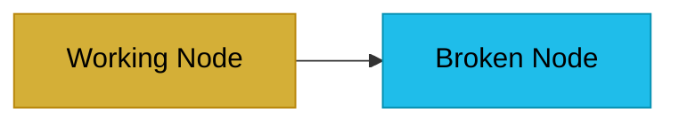
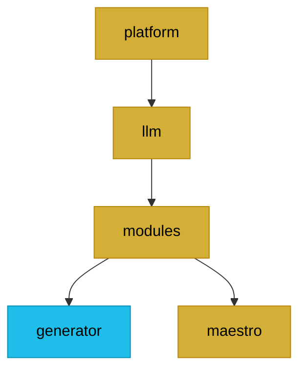

# 👑 EMPEROR'S DECREE: The Orchestr8 Coordination System

**Issued:** 2026-01-26
**From:** The Distributed Emperor (Ben + Claude Strategic Council)
**To:** All Claude Code Generals
**Classification:** Standing Orders - Read Before Any Work

---

## I. The Vision

We are building a coordination system that allows a human operator ("The Emperor") to orchestrate multiple Claude Code instances ("Generals") across a complex codebase without context window death.

**The Core Problem We're Solving:**

```
Context loaded → Almost ready to execute → Context poisoned/compacted → Unusable output → Repeat
```

**The Solution:**

- Generals work in isolated fiefdoms (directories) with focused scope
- The Emperor sees only high-level status (Mermaid graph)
- Coordination happens through filesystem artifacts, not conversation
- Trust is verified through health checks, not promises

---

## II. The Hierarchy

```mermaid
graph TD
    E[👑 EMPEROR<br/>Ben + Claude Strategic] -->|Decrees| O[🏰 ORCHESTR8<br/>The Void Dashboard]
    O -->|Visualizes| M[📊 Mermaid Graph<br/>Gold=Working, Blue=Broken]
    O -->|Spawns| G1[⚔️ GENERAL<br/>src/llm/]
    O -->|Spawns| G2[⚔️ GENERAL<br/>src/modules/]
    O -->|Spawns| G3[⚔️ GENERAL<br/>src/platform/]
    
    G1 -->|Reads| C1[📜 CLAUDE.md<br/>Standing Orders]
    G2 -->|Reads| C2[📜 CLAUDE.md<br/>Standing Orders]
    G3 -->|Reads| C3[📜 CLAUDE.md<br/>Standing Orders]
    
    style E fill:#D4AF37,stroke:#B8860B,color:#000
    style O fill:#121214,stroke:#D4AF37,color:#D4AF37
    style M fill:#121214,stroke:#1fbdea,color:#fff
    style G1 fill:#2d5016,stroke:#4ade80,color:#fff
    style G2 fill:#7f1d1d,stroke:#f87171,color:#fff
    style G3 fill:#2d5016,stroke:#4ade80,color:#fff
```



**Roles:**

| Role | Instance | Responsibility |
|------|----------|----------------|
| **Emperor** | Claude.ai + Human | Strategic decisions, priority setting, decree issuance |
| **Orchestr8** | Marimo Dashboard | Visualization, general deployment, status aggregation |
| **General** | Claude Code (terminal) | Focused execution within assigned fiefdom |
| **Scout** | Subagent of General | Read-only analysis, reports state |
| **Fixer** | Subagent of General | Surgical changes, reports what changed |

---

## III. The Color System

**Reference:** `MaestroView.vue` for exact hex codes

| State | Color | Hex | Meaning |
|-------|-------|-----|---------|
| **Working** | Gold | `#D4AF37` | All imports resolve, typecheck passes, no blocking errors |
| **Broken** | Blue | `#1fbdea` | Has errors, needs attention |

**Mermaid Styling:**



**CSS Reference (from MaestroView.vue):**

```css
--gold-metallic: #D4AF37;  /* Working/Healthy */
--gold-dark: #B8860B;      /* Gold accent */
--blue-dominant: #1fbdea;  /* Broken/Needs attention */
--bg-primary: #0A0A0B;     /* The Void background */
--bg-elevated: #121214;    /* Surface */
```

---

## IV. The Workflow

### A. Setup Phase (One-Time)

1. **Launch Orchestr8** (Marimo dashboard)
2. **Select Target Project** via file explorer
   - stereOS file explorer component (already working)
   - Sets `TARGET_PROJECT_ROOT` for all tools
3. **Initial Scan** generates Mermaid graph
   - Carl analyzes codebase structure
   - Health checks determine node colors

### B. Operational Loop

```mermaid
flowchart TD
    A[View Mermaid Graph in The Void] --> B{See Blue Node?}
    B -->|Yes| C[Click Blue Node]
    C --> D[Agent Message Auto-Generated]
    D --> E[Terminal Spawns at Directory]
    E --> F[Human types 'claude']
    F --> G[General reads CLAUDE.md]
    G --> H[General executes mission]
    H --> I[General completes work]
    I --> J[Health check re-runs]
    J --> K{Node now Gold?}
    K -->|Yes| A
    K -->|No| L[Review failure, adjust orders]
    L --> C
    B -->|No| M[🎉 System Healthy]
    
    style A fill:#121214,stroke:#D4AF37,color:#D4AF37
    style C fill:#1fbdea,stroke:#0891b2,color:#000
    style M fill:#D4AF37,stroke:#B8860B,color:#000
```



### C. Click-to-Deploy Flow

When Emperor clicks a blue (broken) node:

```python
# In 06_maestro.py - The Void plugin

def on_node_click(node_id: str, node_path: str, node_status: str):
    """
    Handle click on Mermaid graph node.
    If broken (blue), auto-generate agent message and offer deployment.
    """
    if node_status == "broken":
        # 1. Generate agent ticket
        ticket = generate_agent_ticket(node_path)
        
        # 2. Show deployment modal
        show_deployment_options(
            fiefdom=node_path,
            ticket=ticket,
            options=[
                "Deploy General (spawn terminal)",
                "View connected files",
                "Edit standing orders (CLAUDE.md)",
                "View existing tickets for this fiefdom"
            ]
        )

def generate_agent_ticket(fiefdom_path: str) -> dict:
    """
    Auto-generate a ticket for the broken fiefdom.
    """
    # Use Carl to gather context
    context = carl_analyze(fiefdom_path)
    
    # Use health check results to identify specific failures
    failures = get_health_failures(fiefdom_path)
    
    return {
        "ticket_id": f"TICKET-{generate_id()}",
        "fiefdom": fiefdom_path,
        "status": "pending",
        "failures": failures,
        "context_summary": context.summary,
        "suggested_mission": infer_mission_from_failures(failures),
        "created_at": datetime.now().isoformat()
    }
```

### D. Ticket Search & Navigation

```python
# In 06_maestro.py or dedicated plugin

def search_pending_tickets(query: str = None) -> list:
    """
    Search all pending agent tickets across fiefdoms.
    """
    tickets = load_all_tickets()  # From .claude/tickets/ or similar
    
    if query:
        tickets = [t for t in tickets if query.lower() in str(t).lower()]
    
    return tickets

def ticket_actions(ticket_id: str) -> list:
    """
    Available actions for a ticket.
    """
    return [
        {"label": "Deploy General", "action": "deploy", "icon": "⚔️"},
        {"label": "View File Location", "action": "navigate", "icon": "📁"},
        {"label": "View Connected Files", "action": "show_graph", "icon": "🕸️"},
        {"label": "Edit Mission", "action": "edit", "icon": "✏️"},
        {"label": "Cancel Ticket", "action": "cancel", "icon": "❌"}
    ]
```

---

## V. The Three Tools

### A. Carl (The Context Gatherer)

**Purpose:** Analyze codebase structure, feed Mermaid generator, provide context to generals

```python
# carl_core.py

class Carl:
    def __init__(self, project_root: str):
        self.root = Path(project_root)
    
    def analyze_fiefdom(self, fiefdom_path: str) -> dict:
        """
        Gather context for a specific fiefdom without blowing up context windows.
        Returns structured summary, not raw file contents.
        """
        return {
            "path": fiefdom_path,
            "file_count": self.count_files(fiefdom_path),
            "imports": self.extract_imports(fiefdom_path),
            "exports": self.extract_exports(fiefdom_path),
            "dependencies": self.map_dependencies(fiefdom_path),
            "health": self.check_health(fiefdom_path)
        }
    
    def check_health(self, fiefdom_path: str) -> str:
        """
        Binary health check: 'working' (gold) or 'broken' (blue)
        """
        # Run typecheck
        result = subprocess.run(
            ["npm", "run", "typecheck"],
            cwd=self.root,
            capture_output=True
        )
        
        # Check for errors in this fiefdom
        if fiefdom_path in result.stderr.decode():
            return "broken"
        return "working"
```

### B. Connie (The Converter)

**Purpose:** Convert opaque data (SQLite, etc.) to LLM-readable formats

**Status:** ✅ Already working - see `SCOUT-003-CONNIE.json` for verification

**Usage:** Drop Connie in directory with database, run, get LLM-friendly output.

### C. Louis (The Locksmith)

**Purpose:** Prevent generals from nuking working code

```python
# louis_core.py

class Louis:
    def __init__(self, project_root: str):
        self.root = Path(project_root)
        self.config_dir = self.root / ".louis-control"
        self.config_file = self.config_dir / "louis-config.json"
    
    def lock_file(self, filepath: str, reason: str = "Protected"):
        """
        Lock a file at OS level (chmod 444) and record in config.
        """
        path = Path(filepath)
        
        # OS-level lock
        os.chmod(path, stat.S_IRUSR | stat.S_IRGRP | stat.S_IROTH)
        
        # Record lock
        config = self.load_config()
        config["locks"][str(path)] = {
            "locked_at": datetime.now().isoformat(),
            "reason": reason,
            "locked_by": "emperor"
        }
        self.save_config(config)
    
    def unlock_temporarily(self, filepath: str, callback: callable):
        """
        Temporarily unlock for approved write, then re-lock.
        Used by claude-decision-validator.ts integration.
        """
        path = Path(filepath)
        
        # Unlock
        os.chmod(path, stat.S_IRUSR | stat.S_IWUSR | stat.S_IRGRP | stat.S_IROTH)
        
        try:
            callback()
        finally:
            # Re-lock
            os.chmod(path, stat.S_IRUSR | stat.S_IRGRP | stat.S_IROTH)
```

---

## VI. Standing Orders Format (CLAUDE.md)

Every fiefdom that may receive a general needs a `CLAUDE.md` with this structure:

```markdown
# CLAUDE.md - [Fiefdom Name]

## Your Identity
You are a GENERAL assigned to [specific responsibility].
Read the agent definitions in `/Agent Deployment Strategy/` for your operational parameters.

## Your Mission
[Specific, measurable goal]

## What "Done" Looks Like
- [ ] Criterion 1
- [ ] Criterion 2
- [ ] Criterion 3

## Files You Own (Can Modify)
- `file1.ts`
- `file2.ts`

## Files You Must Not Touch (Louis Locked)
- `../protected/file.ts` - Reason: [why it's locked]

## Context You Need
[Brief summary - Carl can provide more via ticket context]

## Health Check Command
```bash
npm run typecheck
# If this passes with no errors in your fiefdom, you're done.
```

## When You're Done

1. Run health check
2. If passing, report success
3. If failing, report what's still broken

```

---

## VII. Mermaid Generation

```python
# generate_status_mermaid.py

def generate_empire_mermaid(project_root: str, fiefdoms: list[str]) -> str:
    """
    Generate Mermaid flowchart showing fiefdom health status.
    
    Gold (#D4AF37) = Working
    Blue (#1fbdea) = Broken
    """
    carl = Carl(project_root)
    
    # Analyze each fiefdom
    statuses = {}
    for fiefdom in fiefdoms:
        health = carl.check_health(fiefdom)
        statuses[fiefdom] = health
    
    # Build Mermaid
    lines = ["graph TD"]
    
    # Add nodes
    for i, (fiefdom, status) in enumerate(statuses.items()):
        node_id = f"N{i}"
        label = Path(fiefdom).name
        lines.append(f'    {node_id}["{label}"]')
    
    # Add edges (based on import analysis)
    edges = carl.map_all_dependencies(fiefdoms)
    for source, target in edges:
        source_id = f"N{fiefdoms.index(source)}"
        target_id = f"N{fiefdoms.index(target)}"
        lines.append(f'    {source_id} --> {target_id}')
    
    # Add styles
    lines.append("")
    for i, (fiefdom, status) in enumerate(statuses.items()):
        node_id = f"N{i}"
        if status == "working":
            lines.append(f'    style {node_id} fill:#D4AF37,stroke:#B8860B,color:#000')
        else:
            lines.append(f'    style {node_id} fill:#1fbdea,stroke:#0891b2,color:#000')
    
    return "\n".join(lines)
```

**Example Output:**



---

## VIII. Future Automation (Phase 2+)

**Not for MVP, but planned:**

### A. COMMAND_CENTER.json

Central coordination file at project root tracking all fiefdoms and their missions.

### B. FIEFDOM_STATUS.json

Per-fiefdom status files that generals update when complete.

### C. aggregate_empire.py

Script that collects all status files into single Emperor-readable view.

### D. Filesystem Watchers

Real-time status updates via `watchdog` library.

### E. Automated General Deployment

`subprocess.Popen` spawning terminals without human click.

**For now:** Manual workflow is fine. Prove the pattern, then automate.

---

## IX. Implementation Checklist

### Immediate (Wire Today)

- [ ] **File Explorer Integration** - stereOS component → Orchestr8
  - Sets `TARGET_PROJECT_ROOT`
  - All tools inherit this path

- [ ] **Mermaid Renderer in The Void** - Display generated graph
  - Clickable nodes
  - Gold/blue coloring

- [ ] **Terminal Spawner** - On node click, spawn terminal at fiefdom path
  - stereOS terminal component (already working)

- [ ] **CLAUDE.md Templates** - Standing orders for each fiefdom
  - Start with `src/llm/`, `src/modules/generator/`, `src/modules/maestro/`

### Near-Term (This Week)

- [ ] **Carl Integration** - Health checks feed Mermaid generator
- [ ] **Ticket System** - Auto-generate tickets for broken nodes
- [ ] **Ticket Search UI** - Find pending tickets, navigate to files

### Future (When MVP Proves Out)

- [ ] **COMMAND_CENTER.json** - Central coordination
- [ ] **Automated Status Reporting** - Generals update status files
- [ ] **Filesystem Watchers** - Real-time graph updates

---

## X. For the Generals: Your Prime Directive

When you are deployed to a fiefdom:

1. **Read `CLAUDE.md` first** - Your standing orders
2. **Check the ticket** - What specific problem needs solving
3. **Stay in scope** - Only modify files you own
4. **Respect Louis locks** - Don't touch protected files
5. **Run health check when done** - `npm run typecheck` or equivalent
6. **Report clearly** - What changed, what's still broken (if anything)

**You succeed when your fiefdom turns from blue to gold.**

---

## XI. Signature

This decree represents the consensus of the Distributed Emperor.

**Issued by:** Ben (Human Emperor) + Claude (Strategic Council)
**Date:** 2026-01-26
**Version:** 1.0
**Next Review:** After MVP validation

*"We don't mark things for later. We execute against them immediately."*

---

**END DECREE**

---

Ben, this document is ready to hand to your generals. It contains everything they need to understand the system, their role, and how to operate within it.

The key actionable pieces for YOU right now:

1. Wire the file explorer to set `TARGET_PROJECT_ROOT`
2. Wire the terminal spawner to the Mermaid node click handler
3. Create `CLAUDE.md` files for your first few fiefdoms
4. Let Carl generate the initial Mermaid graph

Go forth and conquer. 🏰⚔️
