# ORCHESTR8 v4.0 ROADMAP: The Codebase Command Center

**Issued:** 2026-01-26
**Author:** Claude (Strategic Council) + Ben (Emperor)
**Status:** APPROVED - Ready for Implementation
**Branch:** main

---

## Table of Contents

1. [Executive Summary](#i-executive-summary)
2. [System Architecture](#ii-system-architecture)
3. [The Void: Primary Interface](#iii-the-void-primary-interface)
4. [The Three-Color System](#iv-the-three-color-system)
5. [Fiefdom Management](#v-fiefdom-management)
6. [The Ticket System](#vi-the-ticket-system)
7. [Agent Deployment Protocol](#vii-agent-deployment-protocol)
8. [The Wisdom System](#viii-the-wisdom-system)
9. [ChangeChecker Integration](#ix-changechecker-integration)
10. [Tool Integration: Carl, Connie, Louis](#x-tool-integration-carl-connie-louis)
11. [Implementation Phases](#xi-implementation-phases)
12. [File Structure](#xii-file-structure)
13. [Technical Specifications](#xiii-technical-specifications)
14. [For the Generals: Operating Manual](#xiv-for-the-generals-operating-manual)

---

## I. Executive Summary

### What is Orchestr8?

Orchestr8 is a **developer tool** that enables a human operator ("The Emperor") to coordinate multiple Claude Code instances ("Generals") across a complex codebase. It exists so that stereOS can be built without context window death.

### The Core Problem

```
Context loaded → Almost ready to execute → Context poisoned/compacted → Unusable output → Repeat
```

### The Solution

- **Generals** work in isolated fiefdoms (directories) with focused scope
- **The Emperor** sees a Mermaid status graph (gold/blue/purple nodes)
- **Coordination** happens through filesystem artifacts, not conversation
- **Wisdom** accumulates per-fiefdom via CAMPAIGN_LOG.md
- **Trust** is verified through health checks, not promises

### Key Principle

> "We'd rather have more agents out and actually complete the job than have fewer and have to do it again."

---

## II. System Architecture

### 2.1 The Full Hierarchy

**CRITICAL: The Emperor MUST see the full subagent choreography. Hiding it doesn't work - this was tested and failed.**

```
┌─────────────────────────────────────────────────────────────────────────────┐
│                              👑 EMPEROR                                      │
│                         (Ben + Claude Strategic)                             │
│                                                                              │
│  Responsibilities:                                                           │
│  ✅ Hold conversation with human leadership                                  │
│  ✅ Create TASK_MANIFEST.json with strategic direction                       │
│  ✅ Receive STATUS_REPORT.json (compressed, minimal context impact)          │
│  ✅ Make decisions requiring human alignment                                 │
│  ✅ Final approval before merges                                             │
│                                                                              │
│  ❌ DO NOT act as Orchestrator                                               │
│  ❌ DO NOT act as Deployment Strategist                                      │
│  ❌ DO NOT make git commits directly                                         │
│  ❌ DO NOT execute fixes directly                                            │
└─────────────────────────────────────────────────────────────────────────────┘
                                    │
                                    │ TASK_MANIFEST.json
                                    ▼
┌─────────────────────────────────────────────────────────────────────────────┐
│                           🏰 ORCHESTR8                                       │
│                        (The Void Dashboard)                                  │
│                                                                              │
│  Responsibilities:                                                           │
│  - Display Mermaid status graph (gold/blue/purple)                          │
│  - Show interactive fiefdom list with stacking notes                        │
│  - Spawn terminals for general deployment                                    │
│  - Generate BRIEFING.md for context injection                               │
│  - Aggregate status from all fiefdoms                                       │
│  - Display error messages from terminals/consoles/builds                    │
│  - Run Ralph Wiggum loop until sprint complete                              │
│  - Compile STATUS_REPORT.json for Emperor                                   │
└─────────────────────────────────────────────────────────────────────────────┘
                                    │
                                    │ WAVE_PLAN.json
                                    ▼
┌─────────────────────────────────────────────────────────────────────────────┐
│                      📋 DEPLOYMENT STRATEGIST                                │
│                                                                              │
│  Responsibilities:                                                           │
│  - Receive WAVE_PLAN.json from Orchestrator                                 │
│  - Maintain FILE_LOCKS.json (collision prevention)                          │
│  - Calculate parallel batches within each wave                              │
│  - Deploy agents with proper context distribution                           │
│  - Monitor agent health and context usage                                   │
│  - Retry failed agents (2x max)                                             │
│  - Report wave completion to Orchestrator                                   │
│                                                                              │
│  CONTEXT WINDOW MANAGEMENT:                                                  │
│  - Track estimated context per agent                                        │
│  - Split large tasks across multiple agents                                 │
│  - Prefer MORE agents with SMALLER scope over fewer with larger scope       │
└─────────────────────────────────────────────────────────────────────────────┘
                                    │
                    ┌───────────────┼───────────────┐
                    │               │               │
                    ▼               ▼               ▼
            ┌─────────────┐ ┌─────────────┐ ┌─────────────┐
            │ ⚔️ GENERAL  │ │ ⚔️ GENERAL  │ │ ⚔️ GENERAL  │
            │  src/llm/   │ │ src/modules/│ │ src/platform│
            └─────────────┘ └─────────────┘ └─────────────┘
                    │
    ┌───────────────┼───────────────┬───────────────┬───────────────┐
    │               │               │               │               │
    ▼               ▼               ▼               ▼               ▼
┌────────┐    ┌────────┐    ┌────────┐    ┌────────┐    ┌────────┐
│ 🔍     │    │ 🔧     │    │ 🔄     │    │ ✓      │    │ 📝     │
│ Scout  │    │ Fixer  │    │Synthzr │    │ Valid  │    │ Git    │
│        │    │        │    │        │    │        │    │ Agent  │
└────────┘    └────────┘    └────────┘    └────────┘    └────────┘
Read-only     Surgical      Pattern       Test          Commits
analysis      changes       detection     runner        only
```

### 2.2 Agent Type Definitions

| Agent | Purpose | Scope | Context Est. | Parallelization |
|-------|---------|-------|--------------|-----------------|
| **Scout** | Deep-dive analysis, trace code paths | Can roam freely | 8-15K tokens | HIGH (read-only) |
| **Fixer** | Apply approved fixes surgically | Limited to assigned files | 5-10K tokens | HIGH (with locks) |
| **Synthesizer** | Combine Scout outputs, identify patterns | Reads Scout outputs | 10K tokens | LOW (depends on Scouts) |
| **Validator** | Verify fixes work, check regressions | Runs tests | 5-8K tokens | MEDIUM |
| **Git Agent** | Handle all git operations | Commits, pushes | 2-3K tokens | LOW |
| **EPO Advocacy** | Ensure decisions serve human user | Reviews failures | 3-5K tokens | LOW |

### 2.3 The Ralph Wiggum Loop

The Orchestrator runs a self-referential execution pattern until completion:

```
START
  │
  ▼
┌─────────────────────────────────────┐
│ Load CHECKPOINT.json (or create)    │
└─────────────────────────────────────┘
  │
  ▼
┌─────────────────────────────────────┐
│ Determine current wave              │◄─────────────────────┐
└─────────────────────────────────────┘                      │
  │                                                          │
  ▼                                                          │
┌─────────────────────────────────────┐                      │
│ Deploy agents for wave              │                      │
│ (via Deployment Strategist)         │                      │
└─────────────────────────────────────┘                      │
  │                                                          │
  ▼                                                          │
┌─────────────────────────────────────┐                      │
│ Collect agent outputs               │                      │
└─────────────────────────────────────┘                      │
  │                                                          │
  ▼                                                          │
┌─────────────────────────────────────┐                      │
│ Any failures?                       │                      │
└─────────────────────────────────────┘                      │
  │YES              │NO                                      │
  ▼                 ▼                                        │
┌──────────┐  ┌─────────────────────────────┐               │
│ Deploy   │  │ Trigger Git Commit Agent    │               │
│ Failure  │  └─────────────────────────────┘               │
│ Scout +  │        │                                        │
│ EPO      │        ▼                                        │
└──────────┘  ┌─────────────────────────────┐               │
  │           │ Update CHECKPOINT.json      │               │
  │           └─────────────────────────────┘               │
  │                 │                                        │
  ▼                 ▼                                        │
┌─────────────────────────────────────┐                      │
│ All waves complete?                 │                      │
└─────────────────────────────────────┘                      │
  │NO               │YES                                     │
  │                 ▼                                        │
  │           ┌─────────────────────────────┐               │
  │           │ SPRINT_COMPLETE             │               │
  │           │ Return to Emperor           │               │
  │           └─────────────────────────────┘               │
  │                                                          │
  └──────────────────────────────────────────────────────────┘
```

### 2.4 Context Window Management Strategy

**Principle: More Agents with Smaller Scope > Fewer Agents with Larger Scope**

| Task Size | Agents | Context per Agent | Rationale |
|-----------|--------|-------------------|-----------|
| Read 1 file | 1 Scout | ~5K tokens | Single focus |
| Read 5 files | 5 Scouts | ~5K each | Parallel, no collision |
| Implement large class | 4+ Fixers | ~8K each | Split by method/section |
| Complex analysis | 1 Scout + 1 Synthesizer | ~10K each | Scout gathers, Synthesizer analyzes |

**Example: Implement LoadCalculationEngine (1000 lines)**

Instead of 1 agent implementing entire class:

| Agent | Section | Lines | Context |
|-------|---------|-------|---------|
| FIXER-A | Core class, init, primary API | ~200 | 10K |
| FIXER-B | Structural load methods | ~200 | 10K |
| FIXER-C | Thermal load methods | ~200 | 10K |
| FIXER-D | Electrical load methods | ~150 | 8K |
| FIXER-E | Plumbing load methods | ~150 | 8K |

**Total: 5 Fixers instead of 1, each with manageable context**

### 2.5 Component Responsibilities

| Component | Runtime | Responsibility |
|-----------|---------|----------------|
| Orchestr8 | Marimo (Python) | Dashboard, visualization, deployment |
| Carl | Python | Context gathering, health checks, Mermaid generation |
| Connie | Python | Database/schema conversion to LLM-friendly format |
| Louis | Python | File locking, permission enforcement |
| General | Claude Code (terminal) | Focused execution within fiefdom |
| Scout | Subagent (Task tool) | Read-only analysis, state reporting |
| Fixer | Subagent (Task tool) | Surgical code changes |
| Validator | Subagent (Task tool) | Test execution, health verification |
| Git Agent | Subagent (Task tool) | Commits, pushes, branch management |

---

## III. The Void: Primary Interface

### 3.1 Layout Specification

```
┌─────────────────────────────────────────────────────────────────────────────┐
│ TOP ROW                                                                      │
│ [Home] ═══ ORCHESTR8 ═══════════════════════ [Agents] [Tickets] [Settings]  │
├─────────────────────────────────────────────────────────────────────────────┤
│                                                                              │
│                              THE VOID                                        │
│                                                                              │
│  ┌────────────────────────────────────────────┐  ┌────────────────────────┐ │
│  │         MERMAID STATUS GRAPH               │  │    FIEFDOM LIST       │ │
│  │                                            │  │                        │ │
│  │     ┌─────┐         ┌─────────┐           │  │  🟡 src/llm           │ │
│  │     │ llm │────────►│ modules │           │  │     Health: WORKING   │ │
│  │     └─────┘         └─────────┘           │  │     Last: 2h ago      │ │
│  │        │                │                  │  │                        │ │
│  │        ▼                ▼                  │  │  🔵 src/generator     │ │
│  │  ┌──────────┐    ┌───────────┐            │  │     Health: BROKEN    │ │
│  │  │ platform │    │ generator │            │  │     Errors: 3         │ │
│  │  └──────────┘    └───────────┘            │  │     [DEPLOY ▼]        │ │
│  │                                            │  │                        │ │
│  │  🟡 = Working (Gold)                      │  │  🟣 src/maestro       │ │
│  │  🔵 = Broken (Blue)                       │  │     Health: COMBAT    │ │
│  │  🟣 = Combat (Purple)                     │  │     General: Active   │ │
│  │                                            │  │     Since: 10m ago    │ │
│  └────────────────────────────────────────────┘  │                        │ │
│                                                   │  [+ Add Fiefdom]      │ │
│  ┌────────────────────────────────────────────┐  └────────────────────────┘ │
│  │ EMERGED MESSAGE (Status Report)            │                              │
│  │                                            │                              │
│  │ [14:32:05] General in src/llm reports:    │                              │
│  │ "Fixed 3 type errors in registry.ts.       │                              │
│  │  Running health check..."                  │                              │
│  │                                            │                              │
│  └────────────────────────────────────────────┘                              │
│                                                                              │
├─────────────────────────────────────────────────────────────────────────────┤
│ BOTTOM FIFTH - The Overton Anchor (NEVER MOVES)                             │
│ ┌─────────────────────────────────────────────────────────────────────────┐ │
│ │ [Attached: src/llm/registry.ts, src/llm/types.ts]                       │ │
│ │                                                                          │ │
│ │ [Emperor Command: ________________________________________________]     │ │
│ │                                                                          │ │
│ │ [Files] [Matrix] [Graph] ══════ [maestro] ══════ [Search] [Deploy] [⏎]  │ │
│ └─────────────────────────────────────────────────────────────────────────┘ │
└─────────────────────────────────────────────────────────────────────────────┘
```

### 3.2 The Void Content Priority

1. **PRIMARY:** Mermaid status graph (situational awareness)
2. **SECONDARY:** Fiefdom list (interaction surface)
3. **TERTIARY:** Emerged messages (status reports from generals)

### 3.3 Panel Emergence System

Panels emerge from specific directions when summoned:

| Panel | Trigger | Direction | Content |
|-------|---------|-----------|---------|
| Tickets Panel | Click "Tickets" or JFDI | Slides from RIGHT | All pending tickets, searchable |
| Agents Panel | Click "Agents" | Slides from TOP | Active generals, subagent status |
| Fiefdom Card | Click node or list item | EMERGES from void center | Detailed fiefdom status |
| Settings | Click "Settings" | Slides from RIGHT | Configuration options |

### 3.4 Fiefdom Card (Emerged Detail View)

When clicking a node or fiefdom list item, a detailed card emerges:

```
┌─────────────────────────────────────────────────────────────────┐
│ FIEFDOM: src/modules/generator                          [✕]    │
├─────────────────────────────────────────────────────────────────┤
│ STATUS: 🔵 BROKEN                                               │
│ HEALTH CHECK: npm run typecheck                                 │
│ LAST CHECK: 2026-01-26 14:30:00                                │
├─────────────────────────────────────────────────────────────────┤
│ ERRORS (3):                                                     │
│ ┌─────────────────────────────────────────────────────────────┐ │
│ │ TS2322: Type 'string' is not assignable to type 'number'   │ │
│ │ → GeneratorView.vue:142                                     │ │
│ │ ─────────────────────────────────────────────────────────── │ │
│ │ TS2304: Cannot find name 'BuildSpec'                        │ │
│ │ → useGenerator.ts:28                                        │ │
│ │ ─────────────────────────────────────────────────────────── │ │
│ │ TS2339: Property 'phases' does not exist on type 'never'   │ │
│ │ → scaffold-engine.ts:89                                     │ │
│ └─────────────────────────────────────────────────────────────┘ │
├─────────────────────────────────────────────────────────────────┤
│ NOTES (Stacking - anyone can add):                              │
│ ┌─────────────────────────────────────────────────────────────┐ │
│ │ [14:00] Ben: "BuildSpec might need import from types.ts"    │ │
│ │ [14:15] Claude-A: "Confirmed, missing import statement"     │ │
│ │ [14:20] Ben: "Also check if phases array init is correct"   │ │
│ │                                                              │ │
│ │ [+ Add Note: ________________________________________] [Add] │ │
│ └─────────────────────────────────────────────────────────────┘ │
├─────────────────────────────────────────────────────────────────┤
│ RECENT CAMPAIGN HISTORY:                                        │
│ • TICKET-038 (Yesterday): Added scaffold templates - VICTORY   │
│ • TICKET-035 (2 days ago): Fixed phase transitions - VICTORY   │
│ • ⚠️ LESSON: Don't modify BuildSpec without updating phases    │
├─────────────────────────────────────────────────────────────────┤
│ ACTIONS:                                                        │
│ [⚔️ Deploy General] [📁 View Files] [🕸️ Show Connections]      │
│ [✏️ Edit CLAUDE.md] [📋 View Full Campaign Log]                 │
└─────────────────────────────────────────────────────────────────┘
```

### 3.5 Interactive Fiefdom List Requirements

The fiefdom list is NOT just a display. It is a **communication surface**:

1. **Stacking Notes:** Anyone (human or agent) who encounters a problem adds notes
2. **Error Aggregation:** All errors from terminals, consoles, builds are captured
3. **Escalation Indicators:** Both warnings (⚠️) and errors (❌) show escalation status
4. **Solution Emergence:** As notes stack, the solution becomes obvious
5. **Historical Context:** Recent campaign history visible at a glance

---

## IV. The Three-Color System

### 4.1 Color Definitions

| State | Color | Hex | Meaning |
|-------|-------|-----|---------|
| **Working** | Gold | `#D4AF37` | All imports resolve, typecheck passes, no blocking errors |
| **Broken** | Blue | `#1fbdea` | Has errors, needs attention |
| **Combat** | Purple | `#9D4EDD` | General currently deployed and active |

### 4.2 State Transitions

```mermaid
graph LR
    A[🟡 WORKING] -->|Error detected| B[🔵 BROKEN]
    B -->|Deploy General| C[🟣 COMBAT]
    C -->|Success| A
    C -->|Failure| B
    A -->|Proactive deployment| C

    style A fill:#D4AF37,stroke:#B8860B,color:#000
    style B fill:#1fbdea,stroke:#0891b2,color:#000
    style C fill:#9D4EDD,stroke:#7c3aed,color:#fff
```



### 4.3 Why Purple Matters

Without the COMBAT state, the Emperor might:

- Deploy a second general to the same fiefdom (friendly fire)
- Not know if a general is still working or has abandoned
- Lose track of active operations

**Purple = "Someone is in there fighting. Do not disturb."**

### 4.4 CSS Reference (from MaestroView.vue)

```css
:root {
    --gold-metallic: #D4AF37;  /* Working/Healthy */
    --gold-dark: #B8860B;      /* Gold accent/stroke */
    --blue-dominant: #1fbdea;  /* Broken/Needs attention */
    --purple-combat: #9D4EDD;  /* Active combat */
    --bg-primary: #0A0A0B;     /* The Void background */
    --bg-elevated: #121214;    /* Surface/cards */
}
```

---

## V. Fiefdom Management

### 5.1 What is a Fiefdom?

A fiefdom is a **directory scope** assigned to a general. It can be:

- A top-level directory: `src/llm/`
- A subdirectory: `src/modules/generator/`
- A specific feature area: `src/platform/auth/`

### 5.2 Fiefdom Granularity

**Principle:** As required. Drop generals where work is needed.

- If there's a lot of work in one spot, deploy a general there
- The playing board starts blank (just hotspots)
- Deploy as required, up to the Emperor
- **Dormant generals cost nothing** - ready to build features at a moment's notice

### 5.3 Fiefdom Structure

Each fiefdom that may receive a general needs:

```
src/modules/generator/
├── CLAUDE.md           # Standing orders (permanent)
├── BRIEFING.md         # Current mission (generated per deployment)
├── CAMPAIGN_LOG.md     # Accumulated wisdom (append-only)
└── [source files]
```

### 5.4 CLAUDE.md Template (Standing Orders)

```markdown
# CLAUDE.md - [Fiefdom Name]

## Your Identity
You are a GENERAL assigned to [specific responsibility].
You have access to subagents: Scout, Fixer, Validator, Git Agent.
Use them. More agents completing work > fewer agents failing.

## Your Fiefdom
**Path:** [absolute path]
**Scope:** [what this directory handles]

## Files You Own (Can Modify)
- `file1.ts`
- `file2.ts`
- `subdirectory/`

## Files You Must Not Touch (Louis Locked)
- `../protected/file.ts` - Reason: [why locked]
- Check Louis config: `.louis-control/louis-config.json`

## Health Check Command
```bash
npm run typecheck
# Your fiefdom is healthy when this passes with no errors in your scope
```

## Integration Points

- **Imports from:** [list of dependencies]
- **Exports to:** [list of consumers]
- **Patterns to follow:** [architectural patterns]

## Known Gotchas

- [Historical lessons from CAMPAIGN_LOG.md]

## When You're Done

1. Run health check
2. Update CAMPAIGN_LOG.md with your actions
3. If VICTORY: Report success, specify what changed
4. If BLOCKED: Report what's blocking, suggest escalation

```

---

## VI. The Ticket System

### 6.1 Ticket Purpose

Tickets are the **work units** that drive general deployment. They capture:
- What's broken
- Where it's broken
- Context for fixing it
- History of attempts

### 6.2 Ticket Structure

```markdown
# TICKET-042: Fix type errors in generator

## Metadata
- **Status:** PENDING | IN_PROGRESS | BLOCKED | RESOLVED
- **Fiefdom:** src/modules/generator
- **Created:** 2026-01-26 14:00:00
- **Priority:** HIGH | MEDIUM | LOW
- **Escalation:** NONE | WARNING | ERROR

## Problem Statement
Type errors preventing build:
- TS2322 in GeneratorView.vue:142
- TS2304 in useGenerator.ts:28
- TS2339 in scaffold-engine.ts:89

## Error Output (Raw)
```

src/modules/generator/GeneratorView.vue:142:15 - error TS2322:
Type 'string' is not assignable to type 'number'.

142     const phase: number = currentPhase.toString();
                    ~~~~~

```

## Context (Carl's Analysis)
- Related files: types.ts, BuildSpec.ts
- Connections: imports from src/llm/types.ts
- Recent changes: BuildSpec interface modified 2 days ago

## Suggested Mission
Import BuildSpec from correct location, fix phase type annotation.

## Notes (Stacking)
| Timestamp | Author | Note |
|-----------|--------|------|
| 14:00 | Carl | Auto-generated from typecheck failure |
| 14:15 | Ben | Check if BuildSpec moved during refactor |
| 14:20 | Claude-A | Confirmed, import path is stale |

## Deployment History
| Timestamp | General | Outcome |
|-----------|---------|---------|
| (none yet) | | |
```

### 6.3 Ticket Lifecycle

```
┌──────────┐     ┌─────────────┐     ┌──────────┐     ┌──────────┐
│ PENDING  │────►│ IN_PROGRESS │────►│ RESOLVED │     │ BLOCKED  │
└──────────┘     └─────────────┘     └──────────┘     └──────────┘
     │                  │                                   ▲
     │                  └───────────────────────────────────┘
     │                         (if general fails)
     │
     └── Auto-created by Carl when health check fails
```

### 6.4 Ticket Storage

```
.orchestr8/
├── tickets/
│   ├── TICKET-042.md
│   ├── TICKET-043.md
│   └── archive/
│       └── TICKET-041.md (resolved)
└── state/
    └── fiefdom-status.json
```

### 6.5 Escalation System

Both warnings and errors trigger escalation:

| Level | Trigger | Action |
|-------|---------|--------|
| **WARNING** | Non-blocking issue, TODO detected | Yellow indicator, note encouraged |
| **ERROR** | Blocking issue, build fails | Red indicator, deployment suggested |
| **CRITICAL** | Multiple failed attempts | Emperor notification required |

**Principle:** Warnings and errors are almost the same - something isn't working properly. Track both.

---

## VII. Agent Deployment Protocol

### 7.1 Click-to-Deploy Flow

```
Emperor clicks blue node
         │
         ▼
┌─────────────────────────────────────┐
│ Fiefdom Card Emerges                │
│ - Shows errors                      │
│ - Shows notes                       │
│ - Shows campaign history            │
│ - [Deploy General] button           │
└─────────────────────────────────────┘
         │
         │ Click Deploy
         ▼
┌─────────────────────────────────────┐
│ Generate BRIEFING.md                │
│ - Ticket details                    │
│ - Error messages                    │
│ - Context from Carl                 │
│ - Recent campaign history           │
│ - Louis lock status                 │
│ - Integration points                │
└─────────────────────────────────────┘
         │
         ▼
┌─────────────────────────────────────┐
│ Update fiefdom status to COMBAT     │
│ (Purple node)                       │
└─────────────────────────────────────┘
         │
         ▼
┌─────────────────────────────────────┐
│ Spawn terminal at fiefdom path      │
│ $ cd /path/to/fiefdom              │
│ $ echo "Read BRIEFING.md"          │
│ $ bash                              │
└─────────────────────────────────────┘
         │
         │ Human types 'claude'
         ▼
┌─────────────────────────────────────┐
│ General reads:                      │
│ 1. BRIEFING.md (current mission)   │
│ 2. CLAUDE.md (standing orders)     │
│ 3. CAMPAIGN_LOG.md (recent history)│
└─────────────────────────────────────┘
         │
         ▼
┌─────────────────────────────────────┐
│ General executes mission            │
│ - Deploys Scout for analysis       │
│ - Deploys Fixer for changes        │
│ - Deploys Validator for testing    │
│ - Deploys Git Agent for commits    │
└─────────────────────────────────────┘
         │
         ▼
┌─────────────────────────────────────┐
│ General completes:                  │
│ 1. Runs health check               │
│ 2. Updates CAMPAIGN_LOG.md         │
│ 3. Reports outcome                 │
└─────────────────────────────────────┘
         │
         ▼
┌─────────────────────────────────────┐
│ Orchestr8 detects completion        │
│ - Re-runs health check             │
│ - Updates node color               │
│ - Archives ticket if resolved      │
└─────────────────────────────────────┘
```

### 7.2 BRIEFING.md Template (Generated Per Deployment)

```markdown
# ⚔️ MISSION BRIEFING: TICKET-042

**Generated:** 2026-01-26 14:32:00
**Fiefdom:** src/modules/generator
**Status:** You are being deployed to a BROKEN fiefdom

---

## 🎯 Objective

Fix type errors in generator module to restore build health.

## ❌ Current Errors

```

src/modules/generator/GeneratorView.vue:142:15 - error TS2322:
Type 'string' is not assignable to type 'number'.

142     const phase: number = currentPhase.toString();
                    ~~~~~

src/modules/generator/useGenerator.ts:28:10 - error TS2304:
Cannot find name 'BuildSpec'.

28   const spec: BuildSpec = reactive({});
              ~~~~~~~~~

```

## 🔍 Carl's Reconnaissance

- **Error Count:** 3 type errors
- **Primary Issue:** Missing/incorrect imports
- **Related Files:**
  - `types.ts` - BuildSpec interface location
  - `GeneratorView.vue` - UI component with type error
  - `useGenerator.ts` - Composable with missing import
- **Connections:**
  - Imports from: `src/llm/types.ts`
  - Exports to: `src/modules/maestro/`

## 🔒 Louis's Restrictions

| File | Status | Reason |
|------|--------|--------|
| `scaffold-cli.ts` | 🔒 LOCKED | Stable CLI interface |
| `../llm/registry.ts` | 🔒 LOCKED | Core registry, don't touch |

## 📜 Recent Campaign History

### TICKET-038 (Yesterday) - VICTORY
- **Action:** Added scaffold templates
- **Lesson:** Template paths are relative to project root

### TICKET-035 (2 days ago) - VICTORY
- **Action:** Fixed phase transitions
- **Lesson:** ⚠️ Don't modify BuildSpec without updating phases array

## 💬 Stacked Notes

| Time | Author | Note |
|------|--------|------|
| 14:00 | Carl | Auto-generated from typecheck |
| 14:15 | Ben | Check if BuildSpec moved during refactor |
| 14:20 | Claude-A | Confirmed, import path is stale |

## ✅ Health Check

```bash
npm run typecheck
# Victory = no errors in src/modules/generator/
```

## 📋 Your Checklist

1. [ ] Read CLAUDE.md for standing orders
2. [ ] Scan CAMPAIGN_LOG.md for recent lessons
3. [ ] Deploy Scout to analyze import paths
4. [ ] Deploy Fixer to correct imports
5. [ ] Deploy Validator to run health check
6. [ ] Update CAMPAIGN_LOG.md with your actions
7. [ ] Report outcome

---

**BEGIN MISSION**

```

### 7.3 Briefing Content Requirements

**Include MAXIMUM context:**
- Filepaths (absolute and relative)
- Integration points (what imports/exports)
- Patterns to follow
- Cautions from previous campaigns
- All error messages (raw output)
- Louis lock status
- Recent notes from anyone who looked at it

**We eat the tokens to do the job right the first time.**

---

## VIII. The Wisdom System

### 8.1 The Core Insight

> "If an agent can hang around long enough in one fiefdom, it will literally gain wisdom. 'Last time this happened, someone broke the contact manager' is the ultimate feet-on-the-street hack, and it's totally free."

### 8.2 How Wisdom Accumulates

```

General A deployed → Fixes bug → Writes to CAMPAIGN_LOG.md → Departs
         │
         ▼
    Wisdom persists in filesystem
         │
         ▼
General B deployed → Reads CAMPAIGN_LOG.md → Has predecessor's knowledge
         │
         ▼
General B encounters similar issue → Already knows the gotcha → Fixes faster

```

### 8.3 CAMPAIGN_LOG.md Format

```markdown
# CAMPAIGN_LOG: src/modules/generator

*Append-only log of all general deployments and lessons learned.*

---

## [2026-01-26 14:45] TICKET-042

**General:** Claude (session abc123)
**Status:** VICTORY
**Duration:** 23 minutes

### Mission
Fix type errors in generator module.

### Actions Taken
1. Deployed Scout to analyze import structure
2. Found BuildSpec import pointing to old location
3. Deployed Fixer to update import paths in 3 files
4. Deployed Validator - health check passed

### Files Modified
- `GeneratorView.vue` - Fixed phase type annotation
- `useGenerator.ts` - Updated BuildSpec import
- `scaffold-engine.ts` - Added missing type import

### Lessons Learned
- ⚠️ BuildSpec moved to `src/llm/types.ts` during LLM refactor
- ⚠️ Always check import paths after any refactor in `src/llm/`
- The `phases` array type depends on BuildSpec - keep them in sync

### Watch List
- `src/modules/maestro/` imports from generator - may need similar fix

---

## [2026-01-25 10:30] TICKET-038

**General:** Claude (session xyz789)
**Status:** VICTORY
**Duration:** 45 minutes

### Mission
Add scaffold templates for new module types.

### Actions Taken
1. Created template files in `templates/`
2. Updated scaffold-engine to load templates
3. Added tests for template rendering

### Lessons Learned
- Template paths must be relative to PROJECT ROOT, not fiefdom
- Use `path.resolve()` not `path.join()` for template loading

### Watch List
- None

---
```

### 8.4 Wisdom Injection

When generating BRIEFING.md, automatically include:

1. Last 3-5 campaign entries
2. All lessons learned (⚠️ items)
3. Active watch list items
4. Relevant notes from ticket stacking

---

## IX. ChangeChecker Integration

### 9.1 The Architecture

```
                    ┌─────────────────────────────────────────┐
                    │         DECISION ENFORCEMENT            │
                    │    (The Connective Layer)               │
                    └─────────────────────────────────────────┘
                                       │
         ┌─────────────────────────────┼─────────────────────────────┐
         │                             │                             │
         ▼                             ▼                             ▼
┌─────────────────┐         ┌─────────────────┐         ┌─────────────────┐
│      CARL       │         │     CONNIE      │         │     LOUIS       │
│ Context Gather  │◄───────►│ Schema Present  │◄───────►│  Lock Enforce   │
└─────────────────┘         └─────────────────┘         └─────────────────┘
         │                             │                             │
         └─────────────────────────────┼─────────────────────────────┘
                                       │
                    ┌─────────────────────────────────────────┐
                    │         CONNECTION VERIFIER             │
                    │   (verification.rs + ParserPack)        │
                    └─────────────────────────────────────────┘
                                       │
                    ┌─────────────────────────────────────────┐
                    │           TICKET SYSTEM                 │
                    │      (.orchestr8/tickets/)              │
                    └─────────────────────────────────────────┘
```

### 9.2 The Decision Gate

Before any write to disk:

```
1. INTERCEPT
   └── Hook into: git pre-commit, Claude Code hook, file watcher

2. CONTEXT CHECK (Carl)
   └── What file? What changed? What's the diff?
   └── Related files? Connections? Dependencies?

3. DECISION VALIDATION
   └── Require: Ticket ID OR Decision Explanation
   └── Cross-ref: Does explanation match the change type?

4. RELATIONSHIP MAPPING (Connie + ConnectionVerifier)
   └── AST analysis of the change
   └── Affected connections (imports, stores, routes)
   └── LLM-friendly summary of impact

5. ENFORCEMENT (Louis)
   └── If valid: Unlock file, allow write, log decision
   └── If invalid: Block write, explain what's missing
   └── Always: Record to audit trail
```

### 9.3 Git Integration (MVP Hack)

**Git knows immediately when files change.** We can tap into this:

```bash
# .git/hooks/post-commit (for tracking)
#!/bin/bash
# Notify Orchestr8 that files changed
python3 -c "
from IP.carl_core import Carl
carl = Carl('.')
carl.check_health_all_fiefdoms()
carl.update_mermaid_graph()
"

# .git/hooks/pre-commit (for enforcement)
#!/bin/bash
# Check if changes are authorized
python3 -c "
from IP.louis_core import Louis
louis = Louis('.')
# Check staged files against locks
for file in \$(git diff --cached --name-only); do
    if not louis.is_write_allowed(file):
        echo \"BLOCKED: \$file is locked\"
        exit 1
done
"
```

### 9.4 File Watcher (Enhanced Version)

For real-time updates without waiting for git:

```python
# orchestr8_watcher.py
from watchdog.observers import Observer
from watchdog.events import FileSystemEventHandler

class ChangeHandler(FileSystemEventHandler):
    def on_modified(self, event):
        if not event.is_directory:
            # Trigger health check for affected fiefdom
            fiefdom = self.get_fiefdom(event.src_path)
            carl.check_health(fiefdom)
            self.update_dashboard()
```

### 9.5 Implementation Priority

| Priority | Component | Effort | Notes |
|----------|-----------|--------|-------|
| 1 | Git pre-commit hook (Louis) | 1-2 hours | Already mostly exists |
| 2 | Git post-commit hook (Carl) | 1-2 hours | Health check trigger |
| 3 | Manual refresh button | 30 min | Fallback mechanism |
| 4 | File watcher (watchdog) | 2-3 hours | Real-time updates |
| 5 | Full Decision Gate | 4-6 hours | Complete enforcement |

**MVP:** Git hooks + manual refresh. Full watcher comes later.

### 9.6 File Migration Note

**When ready to integrate ChangeChecker components:**

Prompt Ben to move the following files from stereOS to Orchestr8:

- `unified-context-system.ts` → Translate to Python or call via subprocess
- `verification.rs` → Keep in Rust, call via subprocess
- `ParserPack/*.rs` → Keep in Rust, call via subprocess
- Connie, Louis, Carl → Already in `IP/`

---

## X. Tool Integration: Carl, Connie, Louis

### 10.1 Carl (The Context Gatherer)

**Location:** `IP/carl_core.py`

**Responsibilities:**

- Scan fiefdoms and build file inventory
- Run health checks (typecheck, tests)
- Generate Mermaid status graph
- Provide context for briefings
- Track connections between files

**Key Functions:**

```python
class Carl:
    def __init__(self, project_root: str):
        self.root = Path(project_root)

    def check_health(self, fiefdom_path: str) -> HealthStatus:
        """
        Run health check for a fiefdom.
        Returns: 'working' | 'broken' with error details
        """
        pass

    def generate_mermaid(self, fiefdoms: list[str]) -> str:
        """
        Generate Mermaid graph with gold/blue/purple coloring.
        """
        pass

    def gather_context(self, fiefdom_path: str) -> FiefdomContext:
        """
        Gather all context needed for a briefing.
        Returns: imports, exports, connections, recent errors
        """
        pass

    def get_all_errors(self, fiefdom_path: str) -> list[Error]:
        """
        Aggregate all errors from typecheck, tests, build.
        """
        pass
```

### 10.2 Connie (The Converter)

**Location:** `IP/connie.py`

**Responsibilities:**

- Convert SQLite databases to LLM-friendly formats
- Export schemas as JSON, Markdown, or CSV
- Make opaque data structures readable

**Status:** ✅ Already working

**Usage:**

```python
from IP.connie import ConnieConverter

connie = ConnieConverter("path/to/database.db")
connie.export_to_markdown("output/schema.md")
connie.export_to_json("output/schema.json")
```

### 10.3 Louis (The Locksmith)

**Location:** `IP/louis_core.py`

**Responsibilities:**

- Lock files at OS level (chmod 444)
- Maintain lock registry
- Integrate with git pre-commit hook
- Temporary unlock for approved writes

**Key Functions:**

```python
class Louis:
    def __init__(self, project_root: str):
        self.root = Path(project_root)
        self.config_dir = self.root / ".louis-control"

    def lock_file(self, filepath: str, reason: str) -> None:
        """Lock file and record in registry."""
        pass

    def unlock_file(self, filepath: str) -> None:
        """Permanently unlock file."""
        pass

    def temporarily_unlock(self, filepath: str, callback: callable) -> None:
        """Unlock, execute callback, re-lock."""
        pass

    def is_locked(self, filepath: str) -> bool:
        """Check if file is locked."""
        pass

    def get_all_locks(self) -> dict:
        """Return all locks with reasons."""
        pass
```

---

## XI. Implementation Phases

### Phase 1: Foundation (Week 1)

**Goal:** Basic Void with Mermaid graph and fiefdom list

| Task | Priority | Effort | Owner |
|------|----------|--------|-------|
| Update `06_maestro.py` with Mermaid as primary | P0 | 2-3 hours | Claude |
| Implement fiefdom list component | P0 | 2-3 hours | Claude |
| Add Carl health check integration | P0 | 2-3 hours | Claude |
| Create CLAUDE.md templates for 3 fiefdoms | P0 | 1 hour | Claude |
| Implement terminal spawner (Linux) | P0 | 1-2 hours | Claude |
| Test full deploy flow manually | P0 | 1 hour | Ben |

**Deliverable:** Can view graph, see broken nodes, spawn terminal at fiefdom

### Phase 2: Ticket System (Week 2)

**Goal:** Full ticket lifecycle with stacking notes

| Task | Priority | Effort | Owner |
|------|----------|--------|-------|
| Create ticket data structure | P0 | 1-2 hours | Claude |
| Implement ticket creation (auto from health check) | P0 | 2-3 hours | Claude |
| Build Tickets panel (slide from right) | P0 | 2-3 hours | Claude |
| Implement stacking notes | P1 | 2 hours | Claude |
| Add error aggregation to tickets | P1 | 2 hours | Claude |
| Implement ticket search | P1 | 1-2 hours | Claude |

**Deliverable:** Tickets auto-created, notes stack, searchable

### Phase 3: Wisdom System (Week 3)

**Goal:** CAMPAIGN_LOG.md and BRIEFING.md generation

| Task | Priority | Effort | Owner |
|------|----------|--------|-------|
| Create CAMPAIGN_LOG.md structure | P0 | 1 hour | Claude |
| Implement campaign entry appending | P0 | 2 hours | Claude |
| Build BRIEFING.md generator | P0 | 3-4 hours | Claude |
| Integrate wisdom into briefings | P0 | 2 hours | Claude |
| Extract lessons learned automatically | P1 | 2-3 hours | Claude |

**Deliverable:** Generals inherit wisdom from predecessors

### Phase 4: ChangeChecker Integration (Week 4)

**Goal:** Git hooks and basic enforcement

| Task | Priority | Effort | Owner |
|------|----------|--------|-------|
| Implement git pre-commit hook (Louis) | P0 | 2 hours | Claude |
| Implement git post-commit hook (Carl) | P0 | 2 hours | Claude |
| Add manual refresh button | P0 | 30 min | Claude |
| Integrate Connection Verifier (if available) | P1 | 4-6 hours | Claude |
| Add file watcher (optional) | P2 | 3 hours | Claude |

**Deliverable:** Changes trigger health checks, locks enforced

### Phase 5: Enhanced Visualization (Future)

**Goal:** PyVis interactive graph, blast radius visualization

| Task | Priority | Effort | Owner |
|------|----------|--------|-------|
| Implement PyVis graph renderer | P2 | 4-6 hours | Claude |
| Add click-to-select on PyVis nodes | P2 | 2-3 hours | Claude |
| Implement blast radius highlighting | P2 | 3-4 hours | Claude |
| Add animation for state transitions | P3 | 2-3 hours | Claude |

**Deliverable:** Interactive graph with physics, blast radius on hover

### Phase 6: Testing Integration (Future)

**Goal:** e2e tests, unit tests in health checks

| Task | Priority | Effort | Owner |
|------|----------|--------|-------|
| Integrate e2e test runner | P2 | 3-4 hours | Claude |
| Add unit test status to health | P2 | 2-3 hours | Claude |
| Import testing IP from other projects | P2 | TBD | Ben |

**Deliverable:** Full test suite in health checks

---

## XII. File Structure

### 12.1 Orchestr8 Directory Structure

```
Orchestr8_jr/
├── ROADMAP_ORCHESTR8_V4.md          # This document
├── CLAUDE.md                         # Project-level standing orders
├── orchestr8.py                      # Original Marimo app (reference)
│
├── IP/                               # The IP Protocol directory
│   ├── orchestr8_app.py             # Main Marimo application
│   ├── carl_core.py                 # Context gatherer
│   ├── connie.py                    # Database converter
│   ├── louis_core.py                # File locker
│   │
│   └── plugins/                     # Marimo plugins
│       ├── 00_welcome.py
│       ├── 01_generator.py          # 7-Phase Wizard
│       ├── 02_explorer.py           # File explorer
│       ├── 03_gatekeeper.py         # Louis UI
│       ├── 04_connie_ui.py          # Connie UI
│       ├── 05_universal_bridge.py   # Tool registry
│       ├── 06_maestro.py            # THE VOID (primary)
│       └── output_renderer.py       # Shared rendering
│
├── .orchestr8/                      # Runtime state
│   ├── tickets/
│   │   ├── TICKET-042.md
│   │   └── archive/
│   ├── state/
│   │   └── fiefdom-status.json
│   └── mermaid-cache.md
│
├── docs/                            # Documentation
│   ├── MAESTROVIEW_MARIMO_CONTEXTUALIZATION.md
│   └── ORCHESTR8_STATUS_HANDOFF.md
│
└── Agent Deployment Strategy/       # Agent definitions
    ├── orchestr8 Agents.md
    ├── AGENT_DEF_SCOUT.md
    ├── AGENT_DEF_FIXER.md
    └── ...
```

### 12.2 Target Project Structure (Fiefdoms)

```
stereOS/  (or any target project)
├── COMMAND_CENTER.json              # Central coordination (future)
├── .louis-control/
│   └── louis-config.json            # Lock registry
│
├── src/
│   ├── llm/                         # FIEFDOM
│   │   ├── CLAUDE.md
│   │   ├── BRIEFING.md
│   │   ├── CAMPAIGN_LOG.md
│   │   └── [source files]
│   │
│   ├── modules/
│   │   ├── generator/               # FIEFDOM
│   │   │   ├── CLAUDE.md
│   │   │   ├── BRIEFING.md
│   │   │   ├── CAMPAIGN_LOG.md
│   │   │   └── [source files]
│   │   │
│   │   └── maestro/                 # FIEFDOM
│   │       ├── CLAUDE.md
│   │       ├── BRIEFING.md
│   │       ├── CAMPAIGN_LOG.md
│   │       └── [source files]
│   │
│   └── platform/                    # FIEFDOM
│       ├── CLAUDE.md
│       ├── BRIEFING.md
│       ├── CAMPAIGN_LOG.md
│       └── [source files]
```

---

## XIII. Technical Specifications

### 13.1 Mermaid Graph Generation

```python
# IP/mermaid_generator.py
from pathlib import Path
from typing import List, Dict, Optional
from dataclasses import dataclass
from enum import Enum

class FiefdomStatus(Enum):
    WORKING = "working"    # Gold - healthy
    BROKEN = "broken"      # Blue - has errors
    COMBAT = "combat"      # Purple - general deployed

@dataclass
class Fiefdom:
    path: str
    status: FiefdomStatus
    connections: List[str]
    error_count: int = 0
    last_check: Optional[str] = None

# Color constants from MaestroView.vue
COLORS = {
    "working": {"fill": "#D4AF37", "stroke": "#B8860B", "text": "#000"},
    "broken": {"fill": "#1fbdea", "stroke": "#0891b2", "text": "#000"},
    "combat": {"fill": "#9D4EDD", "stroke": "#7c3aed", "text": "#fff"},
}

def generate_empire_mermaid(fiefdoms: List[Fiefdom]) -> str:
    """
    Generate Mermaid flowchart with gold/blue/purple coloring.

    Args:
        fiefdoms: List of Fiefdom objects

    Returns:
        Mermaid markdown string ready for mo.mermaid()
    """
    lines = ["graph TD"]

    # Create node ID mapping
    path_to_id = {f.path: f"N{i}" for i, f in enumerate(fiefdoms)}

    # Add nodes with labels
    for i, f in enumerate(fiefdoms):
        node_id = f"N{i}"
        label = Path(f.path).name
        # Add error count to broken nodes
        if f.status == FiefdomStatus.BROKEN and f.error_count > 0:
            label = f"{label} ({f.error_count})"
        lines.append(f'    {node_id}["{label}"]')

    # Add edges based on connections
    for f in fiefdoms:
        source_id = path_to_id[f.path]
        for conn in f.connections:
            if conn in path_to_id:
                target_id = path_to_id[conn]
                lines.append(f'    {source_id} --> {target_id}')

    # Add styles based on status
    lines.append("")
    for i, f in enumerate(fiefdoms):
        node_id = f"N{i}"
        colors = COLORS[f.status.value]
        lines.append(
            f'    style {node_id} fill:{colors["fill"]},'
            f'stroke:{colors["stroke"]},color:{colors["text"]}'
        )

    return "\n".join(lines)


def render_in_marimo(fiefdoms: List[Fiefdom]):
    """Render Mermaid graph in Marimo."""
    import marimo as mo
    mermaid_str = generate_empire_mermaid(fiefdoms)
    return mo.mermaid(mermaid_str)
```

### 13.2 Terminal Spawner

```python
# IP/terminal_spawner.py
import platform
import subprocess
import json
from datetime import datetime
from pathlib import Path
from typing import Optional

class TerminalSpawner:
    def __init__(self, project_root: str):
        self.project_root = Path(project_root)
        self.state_file = self.project_root / ".orchestr8" / "state" / "fiefdom-status.json"

    def update_fiefdom_status(self, fiefdom_path: str, status: str) -> None:
        """Update fiefdom status in state file."""
        self.state_file.parent.mkdir(parents=True, exist_ok=True)

        if self.state_file.exists():
            with open(self.state_file) as f:
                state = json.load(f)
        else:
            state = {"fiefdoms": {}}

        state["fiefdoms"][fiefdom_path] = {
            "status": status,
            "updated_at": datetime.now().isoformat()
        }

        with open(self.state_file, "w") as f:
            json.dump(state, f, indent=2)

    def spawn(
        self,
        fiefdom_path: str,
        briefing_ready: bool = True,
        auto_start_claude: bool = False
    ) -> bool:
        """
        Spawn terminal at fiefdom path and update status to COMBAT.

        Args:
            fiefdom_path: Relative path from project root
            briefing_ready: Whether BRIEFING.md has been generated
            auto_start_claude: Whether to auto-run claude command

        Returns:
            True if spawn succeeded
        """
        abs_path = str(self.project_root / fiefdom_path)

        # Update status to COMBAT (purple)
        self.update_fiefdom_status(fiefdom_path, "combat")

        # Build startup message
        if briefing_ready:
            msg = 'echo "⚔️ BRIEFING.md ready. Type: claude --print \\"Read BRIEFING.md and begin.\\""'
        else:
            msg = 'echo "📜 Read CLAUDE.md for orders. Type: claude"'

        if auto_start_claude:
            msg += ' && claude --print "Read BRIEFING.md and begin."'
        else:
            msg += ' && bash'

        # Platform-specific spawn
        system = platform.system()

        try:
            if system == "Linux":
                # Try gnome-terminal first, fall back to xterm
                try:
                    subprocess.Popen([
                        'gnome-terminal',
                        '--working-directory', abs_path,
                        '--', 'bash', '-c', msg
                    ])
                except FileNotFoundError:
                    subprocess.Popen([
                        'xterm', '-e',
                        f'cd "{abs_path}" && {msg}'
                    ])

            elif system == "Darwin":  # macOS
                script = f'''
                tell application "Terminal"
                    do script "cd '{abs_path}' && {msg}"
                    activate
                end tell
                '''
                subprocess.Popen(['osascript', '-e', script])

            elif system == "Windows":
                subprocess.Popen([
                    'cmd', '/c', 'start', 'cmd', '/k',
                    f'cd /d "{abs_path}" && {msg}'
                ])

            return True

        except Exception as e:
            print(f"Failed to spawn terminal: {e}")
            # Revert status on failure
            self.update_fiefdom_status(fiefdom_path, "broken")
            return False

    def mark_combat_complete(self, fiefdom_path: str, success: bool) -> None:
        """
        Mark combat as complete. Called when general finishes.

        Args:
            fiefdom_path: The fiefdom that was worked on
            success: Whether the mission succeeded (for status update)
        """
        # Status will be updated by next health check
        # This just logs the completion
        self.update_fiefdom_status(
            fiefdom_path,
            "pending_health_check"
        )
```

### 13.3 Health Check Runner

```python
# IP/health_checker.py
import subprocess
from datetime import datetime
from pathlib import Path
from typing import List, Dict, Optional
from dataclasses import dataclass, field

@dataclass
class HealthCheckResult:
    status: str  # "working" | "broken"
    errors: List[str] = field(default_factory=list)
    warnings: List[str] = field(default_factory=list)
    last_check: str = ""
    raw_output: str = ""

class HealthChecker:
    def __init__(self, project_root: str):
        self.project_root = Path(project_root)

    def check_fiefdom(self, fiefdom_path: str) -> HealthCheckResult:
        """
        Run health check for a fiefdom.
        Currently uses npm run typecheck. Future: e2e, unit tests.

        Args:
            fiefdom_path: Relative path from project root (e.g., "src/modules/generator")

        Returns:
            HealthCheckResult with status, errors, warnings
        """
        result = subprocess.run(
            ["npm", "run", "typecheck"],
            cwd=str(self.project_root),
            capture_output=True,
            text=True,
            timeout=120  # 2 minute timeout
        )

        # TypeScript errors go to stdout, not stderr
        output = result.stdout + result.stderr
        errors = []
        warnings = []

        # Parse output for this fiefdom
        for line in output.split('\n'):
            # Check if error is in this fiefdom
            if fiefdom_path in line:
                if 'error TS' in line or 'error:' in line.lower():
                    errors.append(line.strip())
                elif 'warning' in line.lower():
                    warnings.append(line.strip())

        return HealthCheckResult(
            status="broken" if errors else "working",
            errors=errors,
            warnings=warnings,
            last_check=datetime.now().isoformat(),
            raw_output=output
        )

    def check_all_fiefdoms(self, fiefdom_paths: List[str]) -> Dict[str, HealthCheckResult]:
        """
        Run health check once and parse results for all fiefdoms.
        More efficient than running typecheck per fiefdom.
        """
        result = subprocess.run(
            ["npm", "run", "typecheck"],
            cwd=str(self.project_root),
            capture_output=True,
            text=True,
            timeout=120
        )

        output = result.stdout + result.stderr
        results = {}

        for fiefdom in fiefdom_paths:
            errors = []
            warnings = []
            for line in output.split('\n'):
                if fiefdom in line:
                    if 'error TS' in line or 'error:' in line.lower():
                        errors.append(line.strip())
                    elif 'warning' in line.lower():
                        warnings.append(line.strip())

            results[fiefdom] = HealthCheckResult(
                status="broken" if errors else "working",
                errors=errors,
                warnings=warnings,
                last_check=datetime.now().isoformat(),
                raw_output=""  # Only store once, not per fiefdom
            )

        return results
```

### 13.4 Briefing Generator

```python
# IP/briefing_generator.py
from datetime import datetime
from pathlib import Path
from typing import List, Dict, Optional
import json

class BriefingGenerator:
    def __init__(self, project_root: str):
        self.project_root = Path(project_root)

    def load_campaign_log(self, fiefdom_path: str, limit: int = 5) -> List[Dict]:
        """Load recent entries from CAMPAIGN_LOG.md."""
        log_path = self.project_root / fiefdom_path / "CAMPAIGN_LOG.md"
        if not log_path.exists():
            return []

        # Parse markdown entries (simplified - would need proper parser)
        entries = []
        # ... parsing logic ...
        return entries[-limit:]

    def get_locks_for_fiefdom(self, fiefdom_path: str) -> List[Dict]:
        """Get Louis locks relevant to this fiefdom."""
        config_path = self.project_root / ".louis-control" / "louis-config.json"
        if not config_path.exists():
            return []

        with open(config_path) as f:
            config = json.load(f)

        locks = []
        for filepath, lock_info in config.get("locks", {}).items():
            # Include locks in this fiefdom or that this fiefdom might touch
            if fiefdom_path in filepath or filepath.startswith("../"):
                locks.append({
                    "file": filepath,
                    "reason": lock_info.get("reason", "Protected"),
                    "locked_at": lock_info.get("locked_at", "Unknown")
                })
        return locks

    def generate(
        self,
        fiefdom_path: str,
        ticket_id: str,
        ticket_status: str,
        mission: str,
        errors: List[str],
        warnings: List[str],
        notes: List[Dict],
        context: Optional[Dict] = None
    ) -> str:
        """
        Generate BRIEFING.md with MAXIMUM context.

        We eat the tokens to do the job right the first time.
        """
        now = datetime.now()
        locks = self.get_locks_for_fiefdom(fiefdom_path)
        campaign_history = self.load_campaign_log(fiefdom_path, limit=5)

        # Default context if not provided
        if context is None:
            context = {
                "related_files": [],
                "imports_from": [],
                "exports_to": [],
                "patterns": []
            }

        briefing = f"""# ⚔️ MISSION BRIEFING: {ticket_id}

**Generated:** {now.isoformat()}
**Fiefdom:** {fiefdom_path}
**Absolute Path:** {self.project_root / fiefdom_path}
**Status:** You are being deployed to a {ticket_status.upper()} fiefdom

---

## 🎯 Objective

{mission}

## ❌ Current Errors ({len(errors)} total)

```

{chr(10).join(errors) if errors else "No errors recorded"}

```

## ⚠️ Warnings ({len(warnings)} total)

```

{chr(10).join(warnings) if warnings else "No warnings recorded"}

```

## 🔍 Carl's Reconnaissance

- **Error Count:** {len(errors)}
- **Warning Count:** {len(warnings)}
- **Related Files:** {', '.join(context.get('related_files', [])) or 'None identified'}
- **Connections:**
  - Imports from: {', '.join(context.get('imports_from', [])) or 'None identified'}
  - Exports to: {', '.join(context.get('exports_to', [])) or 'None identified'}
- **Patterns to Follow:** {', '.join(context.get('patterns', [])) or 'See CLAUDE.md'}

## 🔒 Louis's Restrictions

| File | Status | Reason |
|------|--------|--------|
"""

        if locks:
            for lock in locks:
                briefing += f"| `{lock['file']}` | 🔒 LOCKED | {lock['reason']} |\n"
        else:
            briefing += "| (none) | - | No locks in this fiefdom |\n"

        briefing += """
## 📜 Recent Campaign History

"""

        if campaign_history:
            for entry in campaign_history:
                briefing += f"""### {entry.get('ticket', 'Unknown')} ({entry.get('date', 'Unknown')}) - {entry.get('status', 'Unknown')}
- **Action:** {entry.get('summary', 'No summary')}
- **Lesson:** {entry.get('lesson', 'None recorded')}
- **Watch List:** {entry.get('watch_list', 'None')}

"""
        else:
            briefing += "*No previous campaigns recorded. You are the first general here.*\n\n"

        briefing += """## 💬 Stacked Notes (Read These Carefully)

| Time | Author | Note |
|------|--------|------|
"""

        if notes:
            for note in notes:
                briefing += f"| {note.get('time', '?')} | {note.get('author', '?')} | {note.get('text', '')} |\n"
        else:
            briefing += "| - | - | No notes yet |\n"

        briefing += f"""
## ✅ Health Check

```bash
npm run typecheck
# Victory = no errors containing "{fiefdom_path}"
```

## 📋 Your Checklist

1. [ ] Read CLAUDE.md for standing orders
2. [ ] Scan CAMPAIGN_LOG.md for recent lessons (especially ⚠️ items)
3. [ ] Deploy Scout to analyze the problem depth
4. [ ] Deploy Fixer to make surgical changes
5. [ ] Deploy Validator to run health check
6. [ ] If errors persist, deploy another Scout cycle
7. [ ] Update CAMPAIGN_LOG.md with your actions AND lessons
8. [ ] Report outcome clearly

## 🚀 Spawn Command Used

```bash
claude --print "Read BRIEFING.md and begin."
```

---

**BEGIN MISSION**

*Remember: You succeed when this fiefdom turns from blue/purple to gold.*
*We'd rather have more agents complete the job than fewer agents fail.*
"""

        return briefing

    def write_briefing(self, fiefdom_path: str, **kwargs) -> Path:
        """Generate and write BRIEFING.md to the fiefdom."""
        content = self.generate(fiefdom_path, **kwargs)
        briefing_path = self.project_root / fiefdom_path / "BRIEFING.md"
        briefing_path.write_text(content)
        return briefing_path

```

---

## XIV. For the Generals: Operating Manual

### 14.1 Prime Directive

When you are deployed to a fiefdom:

1. **Read BRIEFING.md first** - Your current mission with full context
2. **Read CLAUDE.md second** - Your standing orders for this fiefdom
3. **Scan CAMPAIGN_LOG.md** - Learn from your predecessors
4. **Stay in scope** - Only modify files you own
5. **Respect Louis locks** - Don't touch protected files
6. **Use your subagents** - Scout, Fixer, Validator, Git Agent
7. **Run health check when done** - `npm run typecheck` or equivalent
8. **Update CAMPAIGN_LOG.md** - Record your actions and lessons
9. **Report clearly** - What changed, what's still broken (if anything)

**You succeed when your fiefdom turns from blue/purple to gold.**

### 14.2 Subagent Usage

**Scout:** Deploy for read-only analysis
```

Use Task tool with subagent_type=Explore
"Analyze the import structure in this fiefdom"
"Find all files that reference BuildSpec"

```

**Fixer:** Deploy for surgical changes
```

Use Edit tool directly, or Task for complex multi-file changes
"Fix the import path in useGenerator.ts"
"Update type annotation in GeneratorView.vue"

```

**Validator:** Deploy to verify fixes
```

Use Bash tool
"npm run typecheck"
"npm run test -- --filter=generator"

```

**Git Agent:** Deploy for commits
```

Use Bash tool for git operations
"git add . && git commit -m 'fix: correct BuildSpec import paths'"

```

### 14.3 Reporting Format

When mission complete, report in this format:

```

## MISSION REPORT: TICKET-042

**Status:** VICTORY | PARTIAL | BLOCKED
**Duration:** [time spent]

### Actions Taken

1. [What you did]
2. [What you did]

### Files Modified

- `file1.ts` - [what changed]
- `file2.ts` - [what changed]

### Health Check Result

[Pass/Fail with details]

### Lessons Learned

- ⚠️ [Gotcha for future generals]

### Watch List

- [Things that might break due to these changes]

### Escalations (if any)

- [Issues requiring Emperor attention]

```

### 14.4 When to Escalate

Escalate to the Emperor when:
- You're blocked by a Louis lock that seems incorrect
- You discover architectural issues beyond your fiefdom
- Multiple fiefdoms need coordinated changes
- You've failed twice on the same issue
- The ticket scope seems wrong

---

## XV. Signatures

This roadmap represents the strategic consensus of the Orchestr8 project.

**Approved by:**
- Ben (Human Emperor) - 2026-01-26
- Claude (Strategic Council) - 2026-01-26

**Version:** 4.0
**Status:** READY FOR IMPLEMENTATION

---

*"We don't mark things for later. We execute against them immediately."*

---

**END ROADMAP**
